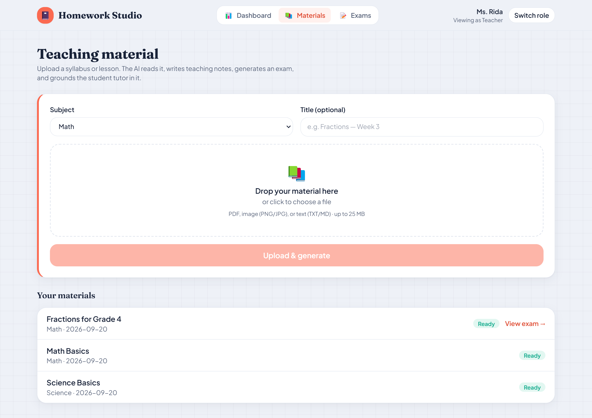
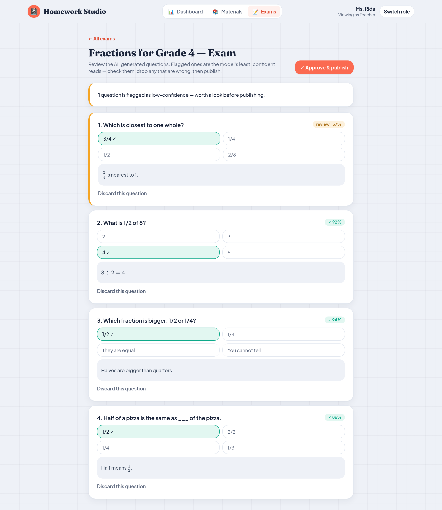
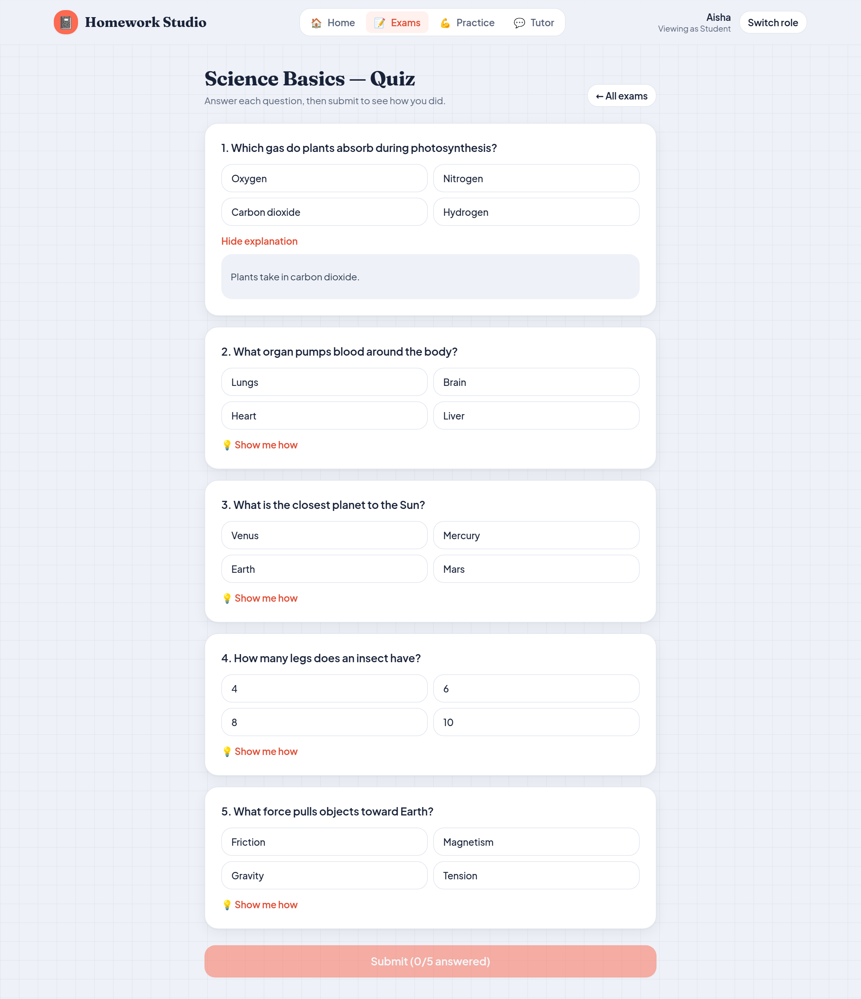
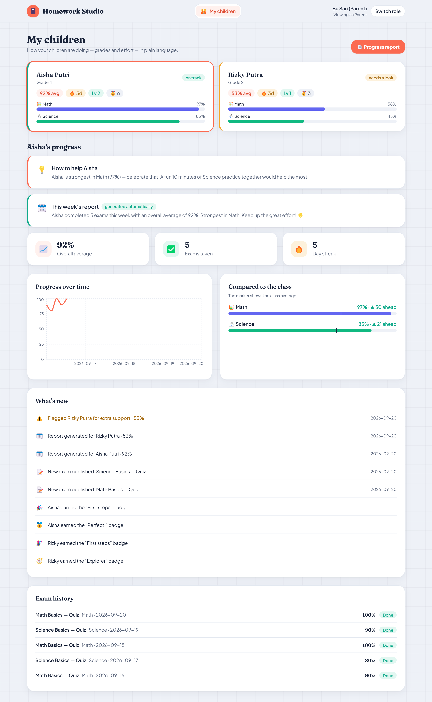
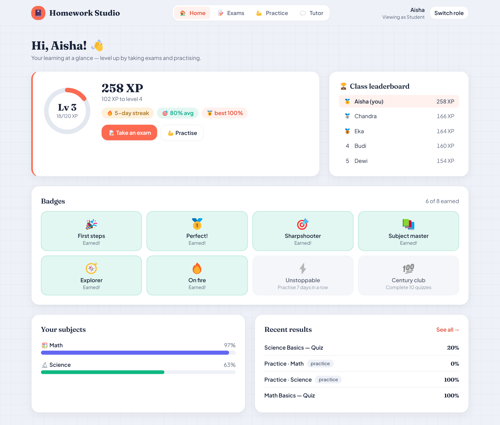
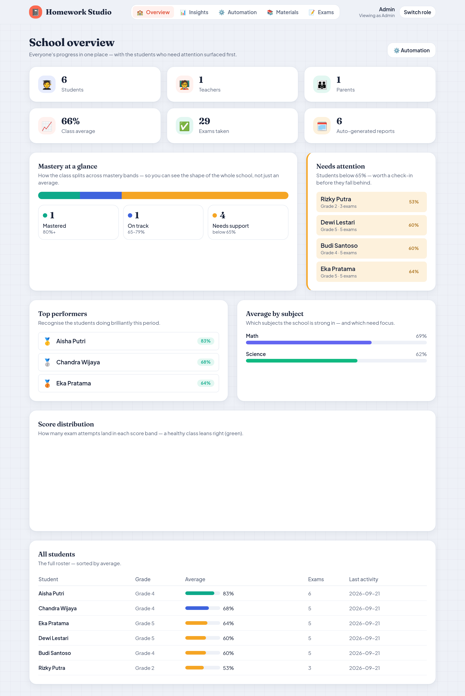
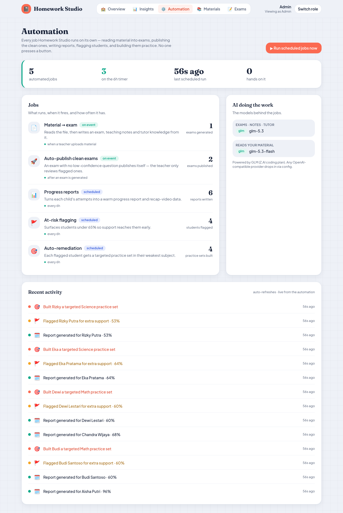
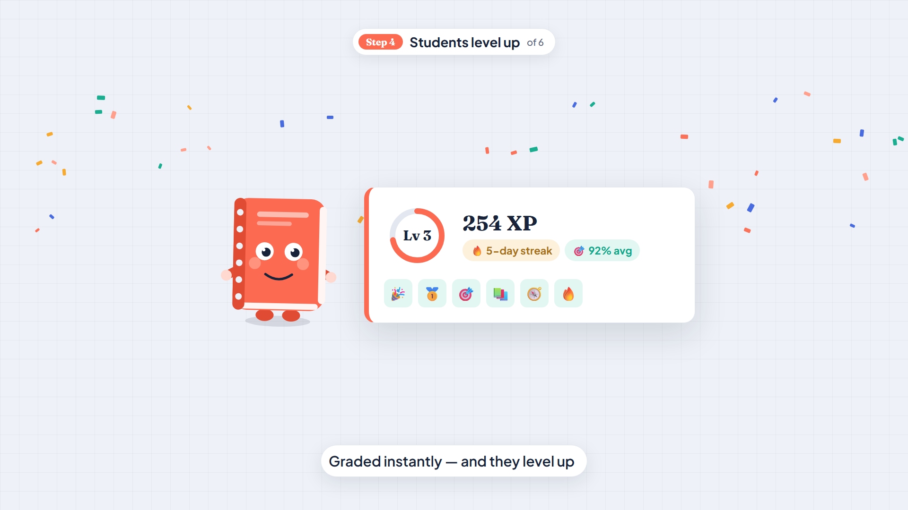

# 📚 Homework Studio

**Teaching material in → AI-generated, teacher-approved exams out — auto-graded, turned into warm progress reports, plus an AI tutor.**

A small, self-hosted EdTech platform that shows the *platform layer* around a
kids' learning product: a teacher uploads material, the AI turns it into an exam
(that the teacher reviews and publishes), students take it and are auto-graded,
parents see the progress, and an AI tutor answers from the class's own material.
Built to run on your own server with a single `docker compose up`.

> **Independent portfolio demo.** Not affiliated with any company. All data is
> synthetic. Built to demonstrate full-stack + AI-automation engineering.

| Upload teaching material | The AI writes the exam — teacher reviews & publishes |
|---|---|
|  |  |
| **Students take it — auto-graded** | **Parents see the progress** |
|  |  |

### The idea in one line

**Material → AI reads it → generates an exam + teaching notes + tutor knowledge →
the least-confident questions are flagged for the teacher → publish → students take
it, auto-graded.** The human-in-the-loop confidence gate sits on the AI's generated
questions, so nothing reaches students the teacher hasn't approved.

### For students, it's a game

XP, levels, a day **streak**, **badges**, and a class **leaderboard** — plus free
**practice** (earns XP, not graded) and a **review** of every past attempt. Progress
that kids actually want to chase.



### Real GLM — it reads your material and writes the exam

With a GLM key, **GLM-5.3-flash** transcribes the uploaded PDF/image (poppler
rasterizes PDFs first) and **glm-5.3** authors multiple-choice questions grounded in
it, each with a self-reported confidence. Questions below the bar are flagged; the
teacher reviews and publishes. Everything runs on a free deterministic mock without a
key.

### Admin monitoring & where the automation shows up

An **admin** role gets a real analytics dashboard and the automation controls:

- **School overview** — **mastery bands** (mastered / on-track / needs-support), a
  **"needs attention"** early-warning list of at-risk students, top performers,
  subject strengths, and the full roster — each with a plain-language explanation.
- **Automation** — the scheduler's live status ("running · every 6h · **0 hands on
  it**"), a **Run now** trigger, the AI models in use, and a **live activity feed**
  where the automation logs what it did: reports written **and at-risk students it
  auto-flagged** for support.

That page — plus the parents' "generated automatically" card — is how the background
automation surfaces in the product.

| School overview (analytics) | Automation (live activity) |
|---|---|
|  |  |

### Watch it — the explainer

A **~70-second narrated walkthrough** of the whole flow — upload material → the AI
builds an exam, notes & a tutor → review & publish → students **level up** → parents
see grades *and* effort → the school at a glance. Built from code with **Remotion** +
a neural voiceover, guided by **Otto** the notebook mascot; captions in
[`docs/demo/captions/`](docs/demo/captions) (`.srt`).

[](docs/demo/explainer.mp4)

### More videos

A **short promo** (~40s) and one per audience:

| 🧑‍🏫 For teachers | 🧒 For students | 🏫 For your school |
|---|---|---|
| [](docs/demo/teacher-promo.mp4) | [](docs/demo/student-promo.mp4) | [](docs/demo/admin-promo.mp4) |

> ℹ️ The promo & role videos are an **earlier cut** (they still say "homework"); the
> **explainer** above and the app reflect the current material → exam flow.

---

## What it does

Four roles, one pipeline:

- **Teacher** — upload **teaching material** (PDF/image/text). The AI reads it and
  generates a **custom exam** (each question with a confidence), **teaching notes**,
  and **tutor knowledge**. Low-confidence questions are flagged; the teacher reviews,
  discards any duds, and **publishes**.
- **Student** — a **gamified home** (XP, levels, day streak, badges, class
  leaderboard), take a **published exam** (auto-graded), **practise** from the bank
  (earns XP, not graded), **review** past attempts, get **"Show me how"** explanations,
  and chat with an **AI tutor** grounded in the teacher's material.
- **Parent** — a **family dashboard**: each child's grades *and* engagement (day
  streak, level, badges), an AI **"how to help"** tip, **compare-to-class**, a
  **"what's new"** feed (reports, badges, new exams, at-risk alerts), and a one-click
  **printable progress report**.
- **Admin** — a school analytics dashboard (mastery bands, at-risk early-warning), an
  **Insights** page (engagement/XP, a 14-day trend, and per-exam analytics including
  the hardest question), and the automation controls.

### The confidence gate (now on the AI's generated questions)

```
material → read → generate exam (per-question confidence) → GATE → decide
                                                              │
              every question cleared the threshold ─────────►  draft (ready to publish)
              any question below threshold ────────────────►  needs_review → teacher approves
```

An exam is published only after the teacher approves it. Questions the model was least
confident about are flagged for review. This is the same human-in-the-loop pattern real
document-ingestion systems use — here the human signs off on AI-authored assessments
before students see them.

---

## Tech stack

| Layer | Choice |
|---|---|
| **Backend** | **Go + Fiber v2**, **pgx** with plain SQL (**no ORM**), `golang-jwt`, embedded SQL migrations |
| **Frontend** | **Vite + React + TypeScript + Tailwind** (SPA), Recharts, react-dropzone, react-markdown + KaTeX; **responsive down to phone width** and an installable **PWA** (offline app shell via a service worker) |
| **Database** | **PostgreSQL** (self-hosted; Supabase-compatible — Supabase *is* managed Postgres) |
| **AI** | Mock by default (free). **GLM** authors the exam + teaching notes + tutor replies, and a **vision reader** transcribes the uploaded material; **DeepSeek / `jev` (TypeAI) / OpenAI** drop in (all OpenAI-compatible) |
| **Automation** | Async coursework pipeline (material → exam, hands-off) + a **background scheduler** that auto-generates each student's weekly report and recap-video data |
| **Deploy** | Docker Compose · single-server friendly |

Clean architecture (`router → handler → usecase → pgx store`), so business logic
(exam generation, grading, explanations) is isolated from HTTP and SQL.

---

## Quick start

Prerequisites: **Docker**. (For local dev without Docker: Go 1.24+, Node 22+.)

```bash
# 1. Start Postgres + backend + frontend
docker compose -f docker/docker-compose.yml --profile full up -d --build

# 2. Seed the demo dataset (one school, 4 logins, 2 subjects, bank, published exams, attempts)
docker compose -f docker/docker-compose.yml --profile tools run --rm seed

# 3. Open the app
#    Frontend  → http://localhost:3000
#    API docs  → http://localhost:8080/health
```

### Demo logins (password `demo1234`)

| Role | Email | What to try |
|---|---|---|
| 🧑‍🏫 Teacher | `teacher@demo.id` | **Materials** → upload a `.txt`/`.md` syllabus → watch it generate an exam → **Exams** → review the flagged question → **Publish** |
| 🧒 Student | `student@demo.id` | **Start** a published exam → answer → **Show me how** → chat with the tutor |
| 👪 Parent | `parent@demo.id` | See Aisha's progress → **Progress report** → Save as PDF |
| 🏫 Admin | `admin@demo.id` | **Overview** (mastery bands, at-risk) → **Automation** (live feed, Run now) |

### Local dev (no Docker for the apps)

```bash
# Postgres only
docker compose -f docker/docker-compose.yml up -d postgres

# Backend
cd backend && cp .env.example .env
go run ./cmd/seed      # seed once
go run ./cmd/api       # http://localhost:8080

# Frontend
cd frontend && npm install && npm run dev   # http://localhost:3000
```

---

## AI configuration

Everything runs on a **deterministic mock provider by default** — no API key, no
spend — so the hosted demo is free and reproducible. Flip to a real provider with
env vars (all OpenAI-compatible):

```bash
# Exam + teaching notes + tutor — GLM via the Z.AI coding plan (OpenAI-compatible)
AI_PROVIDER=glm
AI_API_KEY=<your Z.AI coding-plan key>
AI_BASE_URL=https://api.z.ai/api/coding/paas/v4
AI_MODEL=glm-5.3                    # glm-4.6 also works
# (DeepSeek / TypeAI (jev) / OpenAI work too — same shape, just swap base URL + model.)

# Read the uploaded material — GLM-5.3-flash transcribes a PDF/image to text.
# Falls back to reading text files directly. Key/base URL reuse AI_* by default.
VISION_PROVIDER=glm
VISION_MODEL=glm-5.3-flash

# Background automation: auto-generate each student's weekly report + recap data.
SCHEDULER_ENABLED=true
SCHEDULER_INTERVAL=6h               # also runs once on startup
```

The mock and real paths implement the same interfaces, so switching providers is
a config change, not a rewrite. **For the Docker stack**, copy
`docker/.env.example` → `docker/.env` (gitignored) with your key and
`docker compose up` runs on real GLM — reading your material and authoring the exam.

---

## Project layout

```
homework-studio/
├── backend/                 Go + Fiber + pgx (no ORM)
│   ├── cmd/api              server entrypoint
│   ├── cmd/seed             demo seed
│   └── internal/
│       ├── coursework/      read material → index (RAG) → notes → generate exam → gate
│       ├── vision/          ReadText: transcribe a document (GLM vision / text direct)
│       ├── tutor/           exam generator, teaching notes, explanations, RAG chat
│       ├── scheduler/       background job: auto weekly reports + recap data
│       ├── store/           plain-SQL data access
│       ├── handler/ router/ HTTP
│       └── db/migrations/   embedded SQL schema
├── frontend/                Vite + React + TS + Tailwind SPA
│   └── src/pages/{teacher,parent,student,admin}
├── docker/                  compose (postgres + backend + frontend)
└── docs/                    technical overview, manual, case study
```

---

## Verify it works

```bash
cd backend && go build ./... && go vet ./...     # compiles clean
```

The end-to-end flow: teacher uploads material → the AI generates an exam and flags a
low-confidence question → teacher reviews and publishes → a student takes the exam and
is auto-graded → a parent sees the progress → the admin watches the scheduler.

---

## Documentation

| Doc | What's in it |
|---|---|
| **[Technical overview](docs/TECHNICAL.md)** ([PDF](docs/pdf/technical-overview.pdf)) | Architecture + data-flow diagrams, the ingest pipeline, the **ERD**, the AI/automation design, the API surface, and the stack with the *why* behind each choice. |
| **[User manual](docs/MANUAL.md)** ([PDF](docs/pdf/user-manual.pdf)) | A per-role walkthrough (Teacher / Parent / Student / Admin) with screenshots of the live app. |
| **[Case study](docs/case-study.md)** | How each feature maps to a real product's needs. |

Both the Markdown docs and their PDFs are **generated from source** — screenshots are
captured from the running app and the PDFs rendered (Mermaid diagrams and all) with a
small offline toolchain in [`docs/tooling/`](docs/tooling/). Regenerate with
`cd docs/tooling && npm install && npm run all`.

---

## About

Built by **Akbar Priyono Haryadi** as an independent demo. It assembles patterns
from ~10 years of full-stack work (7 of them on national education platforms).
See **[docs/case-study.md](docs/case-study.md)** for how each piece maps to a real
product's needs, and the engineering decisions behind it.

MIT licensed.
