# 📚 Homework Studio

**Homework in → auto-graded, confidence-gated, and turned into a warm progress report — plus an AI tutor.**

A small, self-hosted EdTech platform that shows the *platform layer* around a
kids' learning product: student homework, teacher review workflows, parent
progress visibility, and an AI practice tutor. Built to run on your own server
with a single `docker compose up`.

> **Independent portfolio demo.** Not affiliated with any company. All data is
> synthetic. Built to demonstrate full-stack + AI-automation engineering.

| Sign in — pick a role | Teacher dashboard |
|---|---|
| 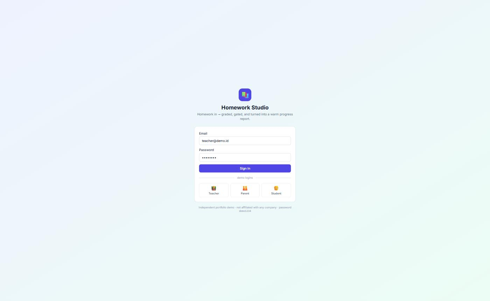 | 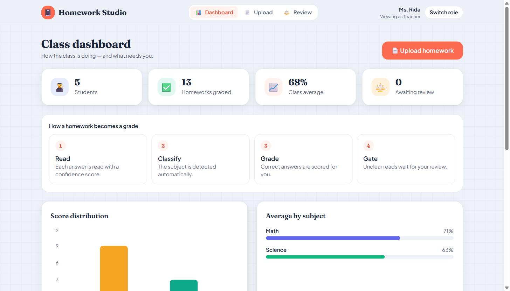 |
| **Upload → read → grade → gate** | **Parent progress** |
| 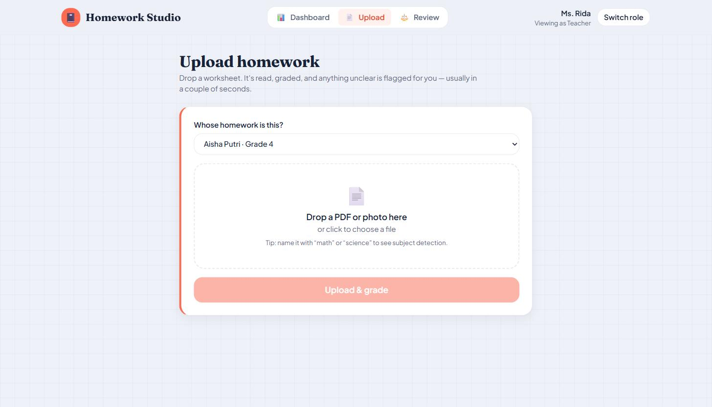 | 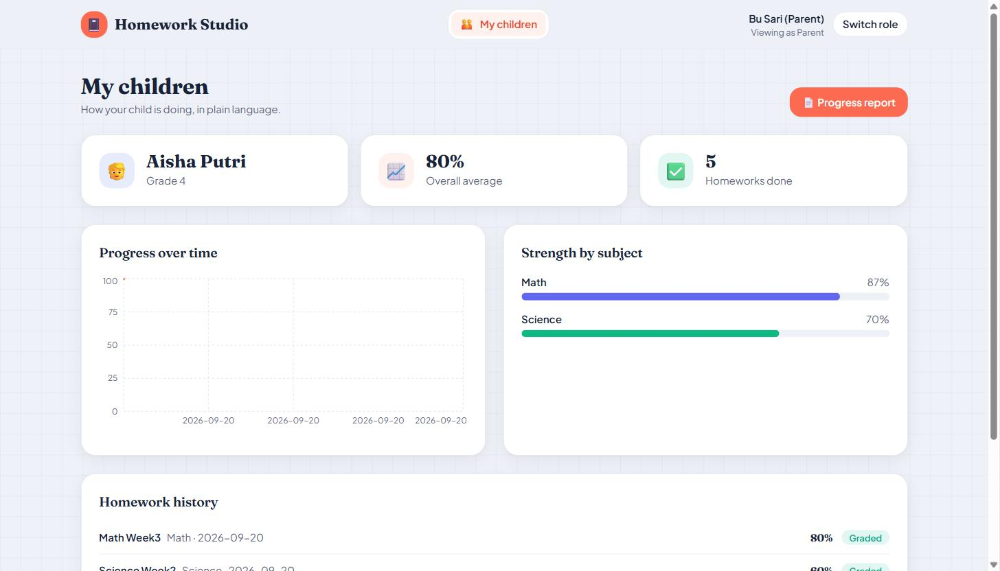 |

### Watch it run — end to end, one per role

Real screen recordings of the live app (synthetic data):

| 🧑‍🏫 Teacher | 👪 Parent | 🧒 Student |
|---|---|---|
| Upload → auto-grade → **review the flagged answer** → re-graded → dashboard updates | See the child's progress → open the **printable report** | Practice → **100%** → "show me how" (LaTeX) → **ask the tutor** |
| 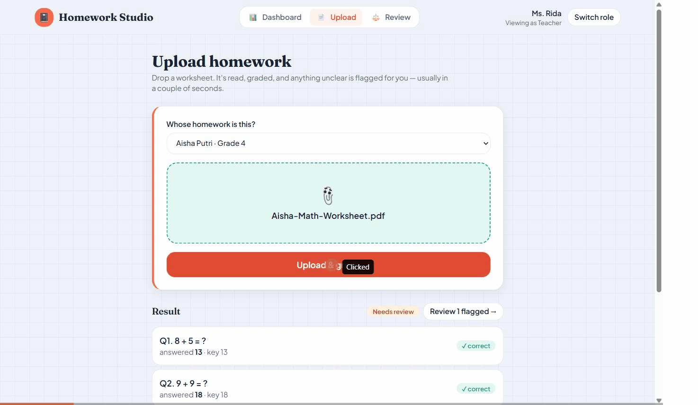 | 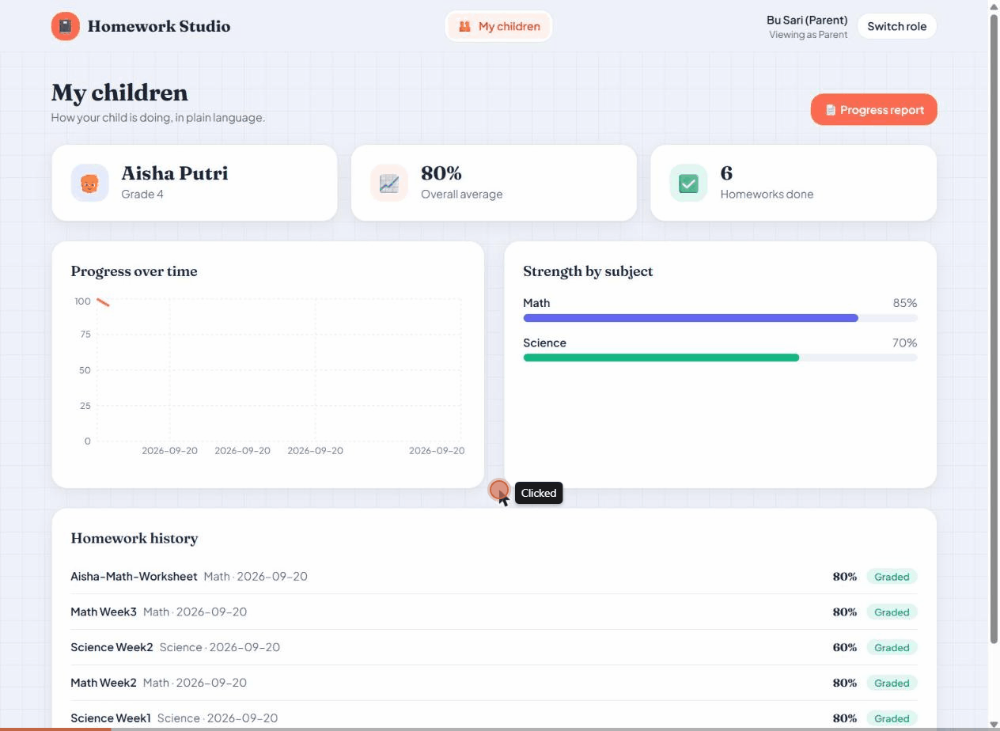 | 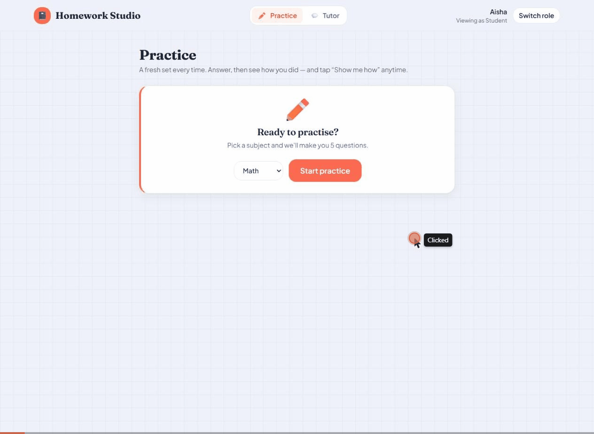 |

### Real GLM vision — it reads an actual photo

With `VISION_PROVIDER=glm`, an uploaded homework **photo or scanned PDF** (poppler
rasterizes the PDF) is read by **GLM-5.3-flash**: it extracts each question and the
handwritten answer, computes the key, and grades. Here it reads a photo, **catches the
wrong answer** (12 + 9 → the student wrote 20, key 21), and grades 80% — no mock.

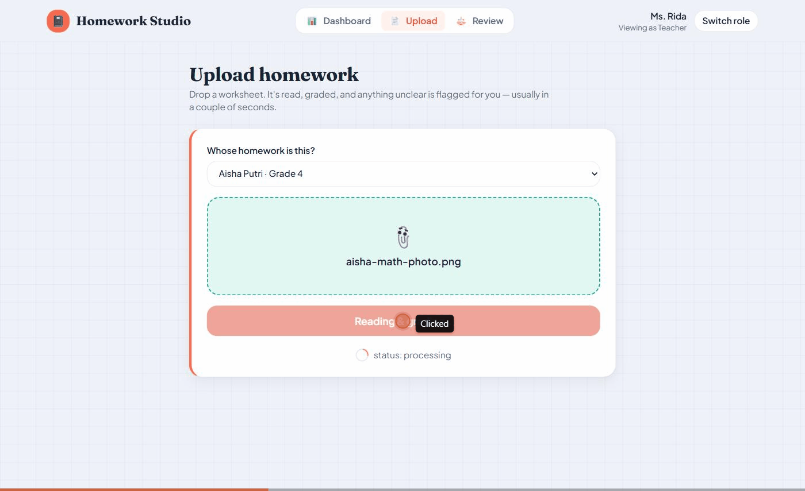

### Admin monitoring & where the automation shows up

An **admin** role monitors the whole school — per-student progress, class averages,
and what needs review — and gets a dedicated **Automation** page: the weekly-report
scheduler's live status ("running · every 6h · 0 hands on it"), which AI models are
in use, and a **live activity feed** of every report generated on its own. That page,
plus the "generated automatically" card parents see, is how the background automation
surfaces in the product.

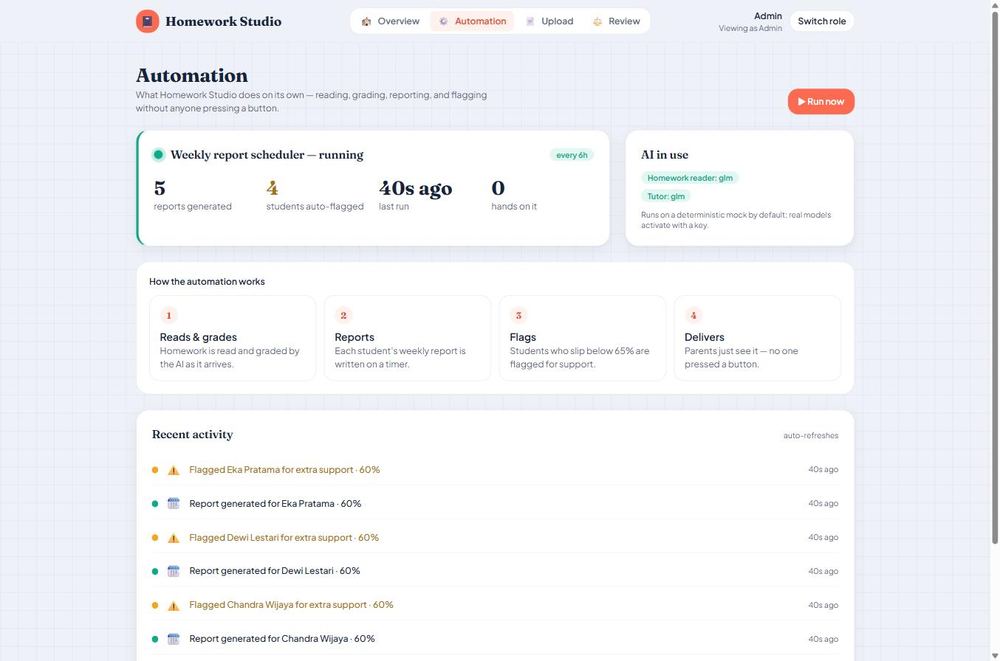

**Animated product video** — a ~40s motion-graphics promo starring **Otto**, the
notebook mascot, walking through the whole story (rendered from code with Remotion):

[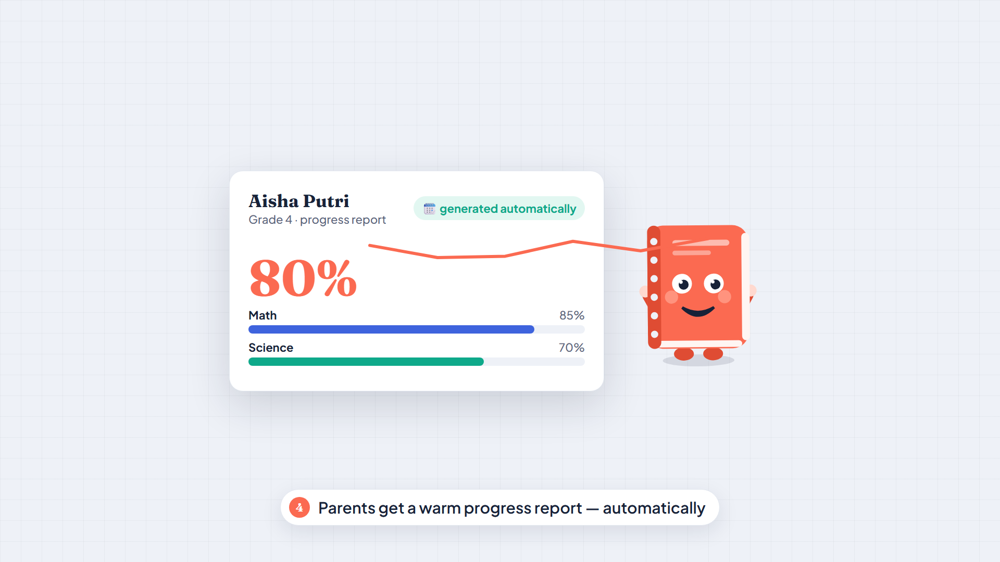](docs/demo/promo.mp4)

**And a short animated promo for each audience** (~15s each):

| 🧑‍🏫 For teachers | 🧒 For students | 🏫 For your school |
|---|---|---|
| [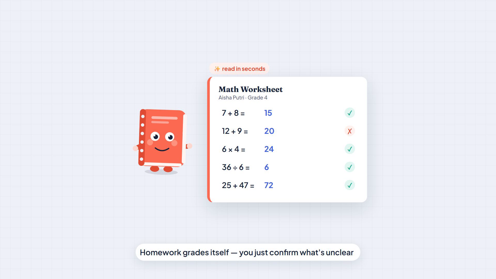](docs/demo/teacher-promo.mp4) | [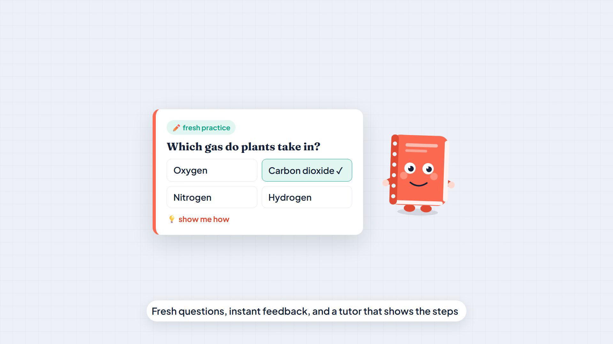](docs/demo/student-promo.mp4) | [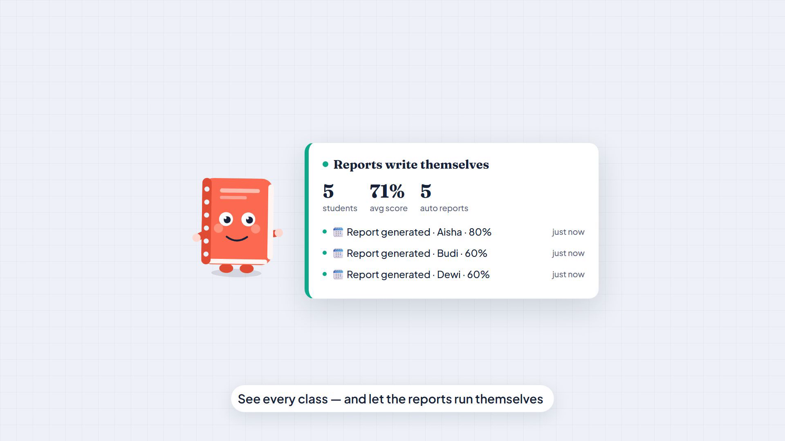](docs/demo/admin-promo.mp4) |

All four are **narrated** with a neural voiceover, with caption tracks in
[`docs/demo/captions/`](docs/demo/captions) (`.srt`). Also in [`video/`](video/):
a slide **walkthrough** (`walkthrough.mp4`) and a data-driven **per-student recap**
(`recap.mp4`).

---

## What it does

Three roles, one pipeline:

- **Teacher** — upload a kid's homework (PDF/photo). It's read question-by-question
  with a **calibrated confidence per answer**, auto-graded, and anything the model
  wasn't sure it read correctly opens a **review task** instead of silently
  grading it. Resolve the task and the homework re-grades itself.
- **Parent** — see your child's progress in plain language: overall average,
  trend over time, strength by subject, and a one-click **printable progress
  report** (Save as PDF).
- **Student** — generate a fresh **practice set**, get instant scoring, tap
  **"Show me how"** for a step-by-step (LaTeX-ready) explanation, and chat with an
  **AI tutor** grounded in the class material.

### The confidence gate (the heart of the ingest side)

```
upload → read (per-field confidence) → classify (jev/TypeAI) → grade → GATE → decide
                                                                          │
                        every field cleared the threshold ──────────────►  graded
                        any field below threshold ─────────────────────►  needs_review → teacher
```

A homework auto-grades only when every field cleared the confidence threshold.
Otherwise a review task names the exact question and reason. This is the same
human-in-the-loop pattern real document-ingestion systems use — here applied to
homework so teachers stay in control of a child's grade.

---

## Tech stack

| Layer | Choice |
|---|---|
| **Backend** | **Go + Fiber v2**, **pgx** with plain SQL (**no ORM**), `golang-jwt`, embedded SQL migrations |
| **Frontend** | **Vite + React + TypeScript + Tailwind** (SPA), Recharts, react-dropzone, react-markdown + KaTeX |
| **Database** | **PostgreSQL** (self-hosted; Supabase-compatible — Supabase *is* managed Postgres) |
| **AI** | Mock by default (free). **GLM** for the tutor + a **vision reader** that reads the homework photo; **`jev` (TypeAI)** for classification. All OpenAI-compatible and swappable |
| **Automation** | Async ingest pipeline (upload → gate, hands-off) + a **background scheduler** that auto-generates each student's weekly report and recap-video data |
| **Deploy** | Docker Compose · single-server friendly |

Clean architecture (`router → handler → usecase → pgx store`), so business logic
(grading, explanations, practice generation) is isolated from HTTP and SQL.

---

## Quick start

Prerequisites: **Docker**. (For local dev without Docker: Go 1.24+, Node 22+.)

```bash
# 1. Start Postgres + backend + frontend
docker compose -f docker/docker-compose.yml --profile full up -d --build

# 2. Seed the demo dataset (one school, 4 logins, 2 subjects, question bank)
docker compose -f docker/docker-compose.yml --profile tools run --rm seed

# 3. Open the app
#    Frontend  → http://localhost:3000
#    API docs  → http://localhost:8080/health
```

### Demo logins (password `demo1234`)

| Role | Email | What to try |
|---|---|---|
| 🧑‍🏫 Teacher | `teacher@demo.id` | Upload a homework named `*math*` or `*science*`, watch it grade + gate, work the review queue |
| 👪 Parent | `parent@demo.id` | See Aisha's progress → **Progress report** → Save as PDF |
| 🧒 Student | `student@demo.id` | Generate practice → **Show me how** → chat with the tutor |

### Local dev (no Docker for the apps)

```bash
# Postgres only
docker compose -f docker/docker-compose.yml up -d postgres

# Backend
cd backend && cp .env.example .env
go run ./cmd/seed      # seed once
go run ./cmd/api       # http://localhost:8080

# Frontend
cd frontend && npm install && npm run dev   # http://localhost:3000
```

---

## AI configuration

Everything runs on a **deterministic mock provider by default** — no API key, no
spend — so the hosted demo is free and reproducible. Flip to a real provider with
env vars (all OpenAI-compatible):

```bash
# Tutor + explanations — GLM via the Z.AI coding plan (OpenAI-compatible)
AI_PROVIDER=glm
AI_API_KEY=<your Z.AI coding-plan key>
AI_BASE_URL=https://api.z.ai/api/coding/paas/v4
AI_MODEL=glm-5.3                    # glm-5.3-flash / glm-4.6 also work
# (DeepSeek / OpenAI work too — same shape, just swap base URL + model.)

# Read the actual homework photo — GLM-5.3-flash (verified). Falls back to mock
# for PDFs and on error. Key/base URL reuse AI_* (same Z.AI key) by default.
VISION_PROVIDER=glm
VISION_MODEL=glm-5.3-flash

# Homework classification via jev (TypeAI)
CLASSIFIER_PROVIDER=typeai
CLASSIFIER_API_KEY=...
CLASSIFIER_MODEL=jev

# Background automation: auto-generate each student's weekly report + recap data.
SCHEDULER_ENABLED=true
SCHEDULER_INTERVAL=6h               # also runs once on startup
```

The mock and real paths implement the same interfaces, so switching providers is
a config change, not a rewrite. **For the Docker stack**, copy
`docker/.env.example` → `docker/.env` (gitignored) with your key and
`docker compose up` runs on real GLM — including GLM-5.3-flash reading actual
homework photos.

---

## Project layout

```
homework-studio/
├── backend/                 Go + Fiber + pgx (no ORM)
│   ├── cmd/api              server entrypoint
│   ├── cmd/seed             demo seed
│   └── internal/
│       ├── pipeline/        read → classify → grade → gate → decide
│       ├── vision/          GLM vision reader + jev classifier (mock default)
│       ├── tutor/           explanations, practice generator, RAG chat
│       ├── scheduler/       background job: auto weekly reports + recap data
│       ├── store/           plain-SQL data access
│       ├── handler/ router/ HTTP
│       └── db/migrations/   embedded SQL schema
├── frontend/                Vite + React + TS + Tailwind SPA
│   └── src/pages/{teacher,parent,student}
├── docker/                  compose (postgres + backend + frontend)
└── docs/                    case study, screenshots
```

---

## Verify it works

```bash
cd backend && go build ./... && go vet ./...     # compiles clean
```

The end-to-end flow is exercised by `docs/smoke-test` steps: teacher uploads →
gate opens a review task → resolve → graded; student generates + grades a
practice set + gets an explanation; parent sees progress and is blocked (403)
from another child.

---

## About

Built by **Akbar Priyono Haryadi** as an independent demo. It assembles patterns
from ~10 years of full-stack work (7 of them on national education platforms).
See **[docs/case-study.md](docs/case-study.md)** for how each piece maps to a real
product's needs, and the engineering decisions behind it.

MIT licensed.
