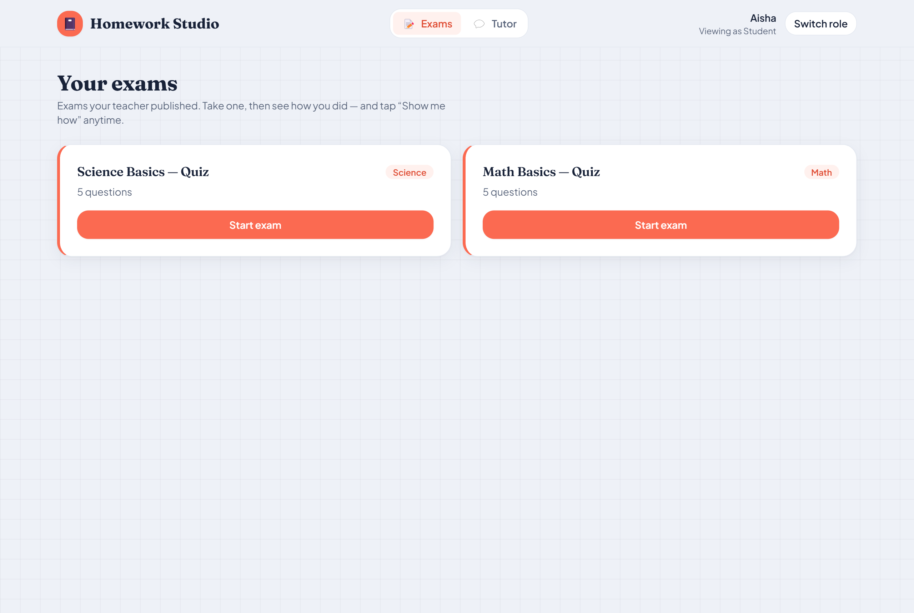
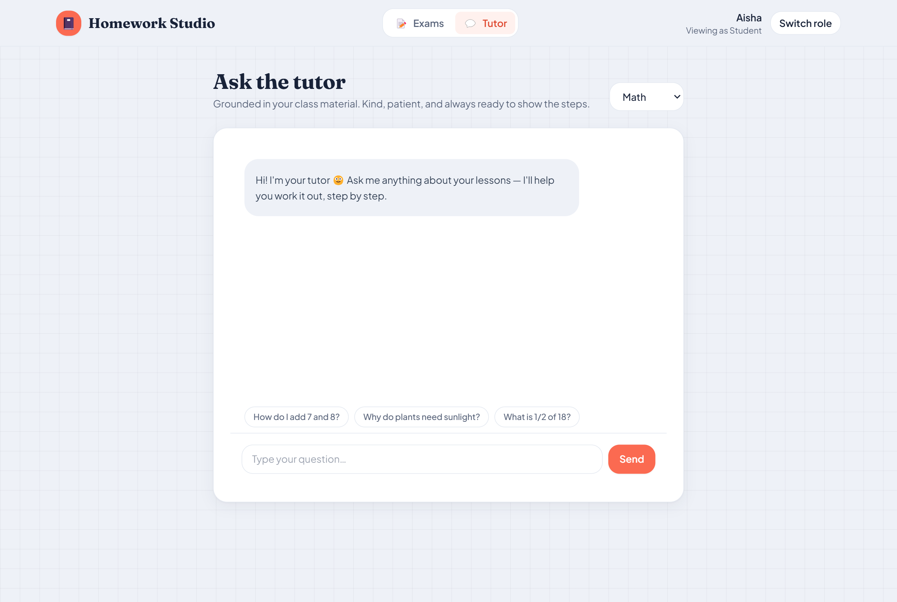
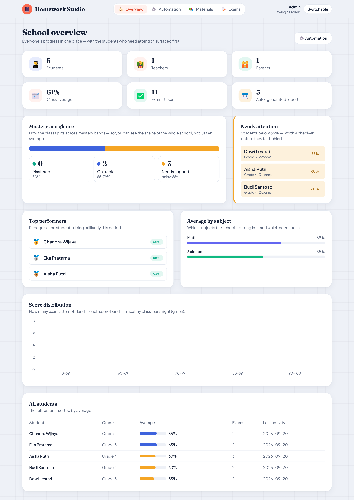
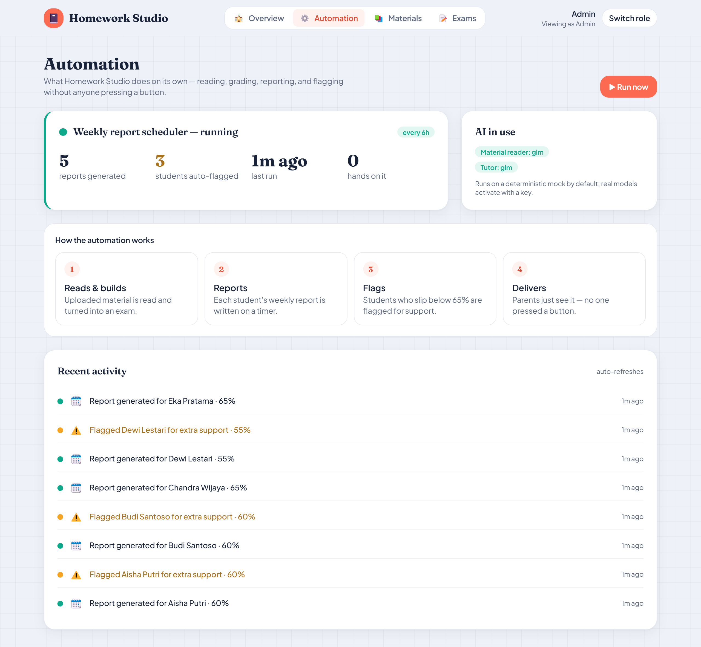

# Homework Studio — User Manual

**A step-by-step guide to the four roles: Teacher, Parent, Student, and Admin.**

> Independent portfolio demo. All students and data are synthetic. This manual walks
> through what each person does, with screenshots of the live app.

---

## Getting started

Open the app and you land on the sign-in screen. Instead of typing a password, you
pick a **role** to explore the demo — one tap signs you in as a sample user.

**Demo accounts** — every account uses the password `demo1234`:

| Role | Email | Lands on |
|---|---|---|
| 🧑‍🏫 Teacher | `teacher@demo.id` | Class dashboard |
| 👪 Parent | `parent@demo.id` | Your children's progress |
| 🧒 Student | `student@demo.id` | Your exams |
| 🏫 Admin | `admin@demo.id` | School overview |

Switch roles anytime with **Switch role** in the top-right corner.

---

## What you can upload — and what the AI makes from it

The teacher uploads **teaching material** (a syllabus or lesson). Nothing else in the
app requires an upload.

**Accepted formats:**

| Type | Extensions | Read by |
|---|---|---|
| Document | `.pdf` | The vision model (the first page is rasterized and transcribed) |
| Image | `.png`, `.jpg`, `.jpeg` | The vision model (transcribed to text) |
| Text | `.txt`, `.md` | Read directly |

- **One file per upload**, up to **25 MB**.
- `.docx` is not supported yet — export to PDF or paste into a `.txt`/`.md` first.
- On the free demo (no AI key), plain-text `.txt`/`.md` works best, since reading a
  PDF or photo needs the vision model.

**From one material, the AI produces three things:**

1. **A custom exam** — multiple-choice questions grounded in your material, that
   students take and get auto-graded.
2. **Teaching notes** — a short lesson summary (key points + a worked example).
3. **Tutor knowledge** — the material is indexed so the student tutor answers from
   *your* class's content.

---

## 🧑‍🏫 Teacher

**What you do:** upload material, let the AI turn it into an exam, review the
questions, and publish. Then watch how the class does.

### The dashboard

You land on the class at a glance: how many students, how many exams have been taken,
the class average, and how many AI questions are **awaiting your review**. Below are
the four-step flow, the score distribution, the per-subject averages, and your recent
materials.

### Step by step: material → a published exam

**1. Open Materials → choose a subject and (optionally) a title.**
**2. Drop your file** onto the box, or click to browse. The accepted formats and the
25 MB limit are shown right under the drop zone.

**3. Press "Upload & generate".** The material now moves through the pipeline. You'll
see its status change:

| Status | What it means |
|---|---|
| **Processing…** | The AI is reading the material, writing notes, and generating the exam. Usually a few seconds (longer for a PDF/photo). |
| **Ready** ✅ | Done — teaching notes were written and an exam was generated. A **View exam →** link appears. |
| **Failed** | The file couldn't be read (corrupt file, or an image/PDF with no AI key). Try a `.txt`/`.md`, or check the file. |

**4. Review the generated exam.** Open the exam (from **View exam →** or the **Exams**
tab). Every question shows the AI's **confidence**. The ones the model was *least*
sure about are **flagged for review** (amber) — that's the human-in-the-loop gate:
nothing reaches students until you approve it.

For each question you can:
- **Keep it** — the correct answer is highlighted in green; a confidence badge shows
  how sure the AI was.
- **Discard this question** — drops a question that's wrong or off-topic.

**5. Press "Approve & publish".** The exam's status becomes **Published** and it
appears for students. That's it — the material is now an assessment.

**What "success" looks like:** the material reads **Ready**, the exam has sensible
questions (flagged ones checked), and after publishing its badge is **Published**.
**What "needs a look" looks like:** an exam badge of **Needs review** with a flagged
count — one or more questions the AI wasn't confident about, waiting for you.

**Exam states:**

| Exam status | Meaning |
|---|---|
| **Draft** | Generated; every question cleared the confidence bar. Publish when ready. |
| **Needs review** | One or more questions are flagged — check them before publishing. |
| **Published** | Live for students. |

---

## 🧒 Student

**What you do:** take the exams your teacher published, see how you did, and learn.

### 1. Your exams

The **Exams** page lists every exam published for your subjects. Pick one and press
**Start exam**.

### 2. Answer, submit, and learn

Tap an option for each question, then **Submit** to see your score. At any time tap
**💡 Show me how** for a step-by-step explanation (math renders properly). When you're
done you get an instant percentage and can review every answer.

### 3. Ask the tutor

Open **Tutor** to chat. It's patient, explains step by step, and answers from **your
class's material** (the teacher's uploads), not the whole internet.

---

## 👪 Parent

**What you do:** see how your child is doing, and open a printable report.

### 1. Your child's progress

**My children** opens on your child's progress: their overall average, how many exams
they've taken, a **trend over time**, and **strength by subject**. At the top you may
see **This week's report** — written **automatically** by the system, no one pressing
a button.

### 2. The printable report

Press **Progress report** for a clean, one-page report — a warm summary, headline
numbers, strength by subject, and the full exam history. Use your browser's **Save as
PDF** (the 🖨️ button) to keep or share it.

---

## 🏫 Admin

**What you do:** monitor the whole school and watch the automation work.

### 1. School overview

**Overview** is the school at a glance: totals, the class average, and **mastery
bands** (mastered / on track / needs support). The **Needs attention** panel surfaces
students below 65% first. Below are top performers, strength by subject, the score
distribution, and the full roster — each with a plain-language note.

### 2. Automation

**Automation** is where the background work shows up: the scheduler's status
("running · every 6h · **0 hands on it**"), how many reports it wrote and how many
students it **auto-flagged**, which **AI models** are in use, and a **live activity
feed**. Press **▶ Run now** to trigger a run immediately.

> Admins can also open the teacher's **Materials** and **Exams** tools from the nav.

---

## Documents the system produces

Besides the exam, two other documents come out of one upload:

- **Teaching notes** — a lesson summary (key points + a worked example) generated from
  your material, shown on the material.
- **The parent progress report** — a one-page, printable report per child (Save as PDF
  from the browser), refreshed automatically each week by the background scheduler.

---

## Frequently asked

**Do I need an API key to try it?** No. Everything runs on a free, built-in demo mode
by default. Real AI models (reading PDFs/photos, richer exam generation, the tutor)
turn on with a key.

**What can I upload, and how big?** One file per material: **PDF, PNG, JPG, TXT, or
MD**, up to **25 MB**. (`.docx` isn't supported yet.)

**Who grades the exams?** They're **auto-graded** the moment a student submits. The
teacher's review is on the *questions* (before publishing), not on each student's
answers.

**It works on my phone?** Yes — responsive to phone width, and installable (Add to
Home Screen) as an app with an offline shell.

---

*See [`TECHNICAL.md`](TECHNICAL.md) for the architecture, data flow, and database
design behind these screens.*
