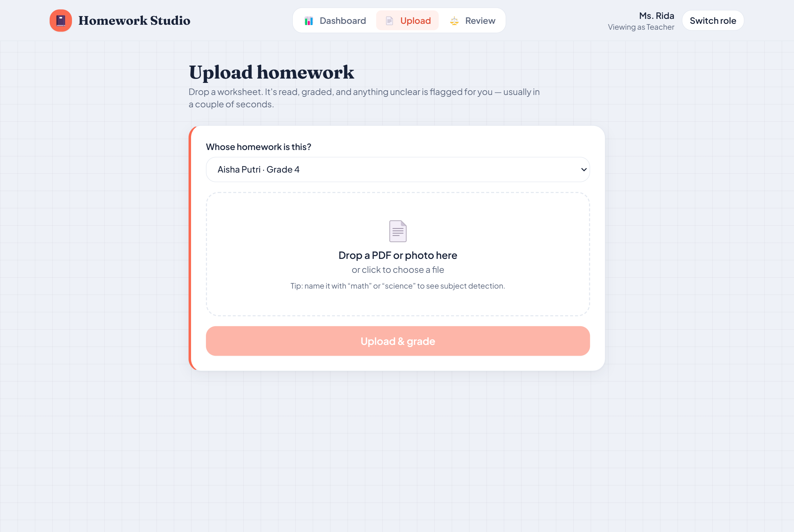
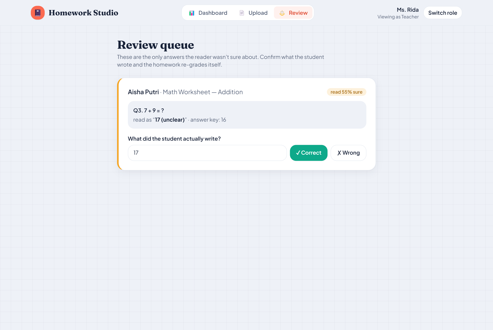
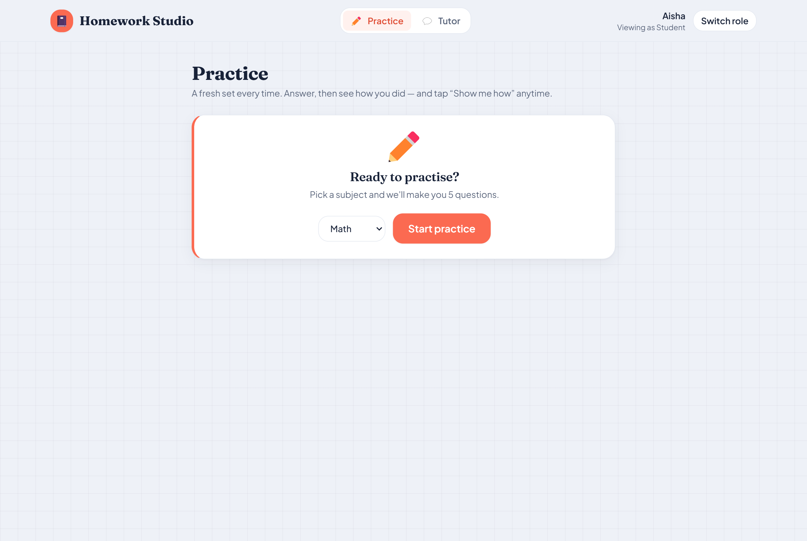
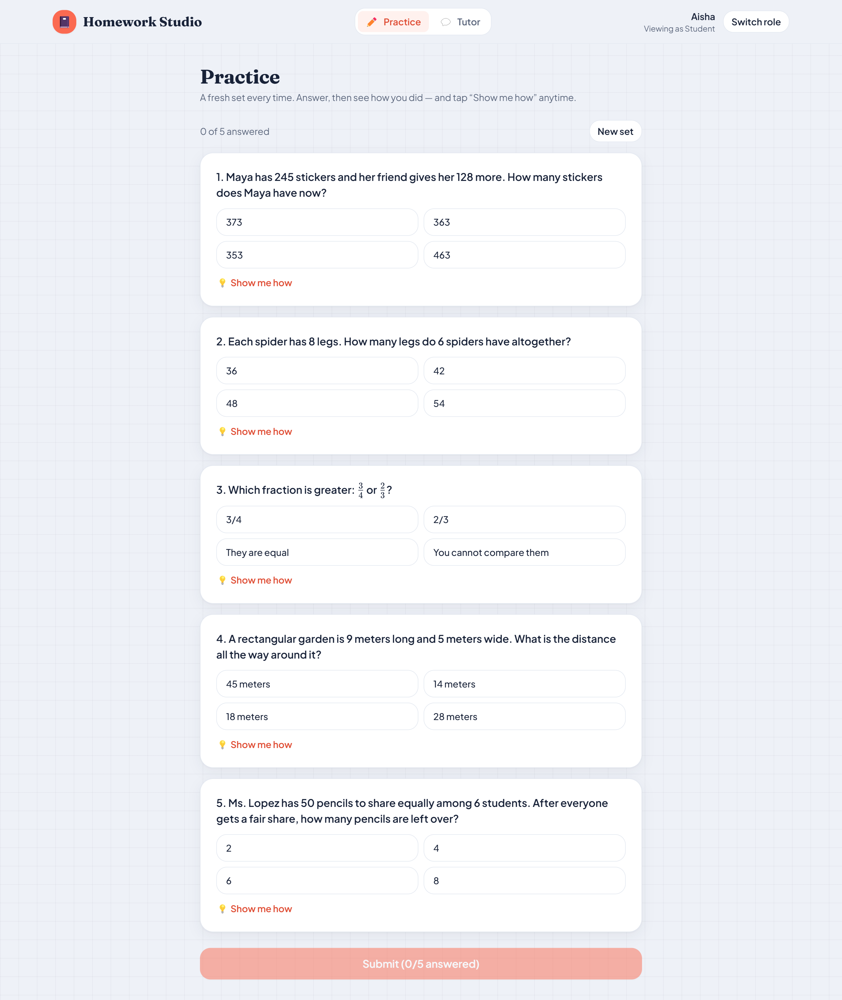

# Homework Studio — User Manual

**A guide to the four roles: Teacher, Parent, Student, and Admin.**

> Independent portfolio demo. All students and data are synthetic. This manual walks
> through what each person sees and does, with screenshots of the live app.

---

## Getting started

Open the app and you land on the sign-in screen. Instead of typing a password, you
pick a **role** to explore the demo — one tap signs you in as a sample user for that
role.

**Demo accounts** — every account uses the password `demo1234`:

| Role | Email | Lands on |
|---|---|---|
| 🧑‍🏫 Teacher | `teacher@demo.id` | Class dashboard |
| 👪 Parent | `parent@demo.id` | Your children's progress |
| 🧒 Student | `student@demo.id` | Practice |
| 🏫 Admin | `admin@demo.id` | School overview |

You can switch roles at any time with **Switch role** in the top-right corner.

---

## 🧑‍🏫 Teacher

**What you can do:** upload a child's homework and let it grade itself, review anything
the reader wasn't sure about, and see how the whole class is doing.

### 1. The class dashboard

After signing in you see the class at a glance: how many students, how many homeworks
are graded, the class average, and how many answers are **awaiting your review**. If
anything needs you, a banner at the top takes you straight to it. Below are the score
distribution, the average per subject, and your most recent homework.

### 2. Upload a homework

Go to **Upload**. Choose which student the homework belongs to, then drop a **PDF or
photo** onto the box (or click to browse). Tip: if the file name contains "math" or
"science", the subject is detected automatically.

Press **Upload & grade**. In a couple of seconds the homework is read
question-by-question, graded, and — if every answer was read clearly — marked done.
Each answer is shown as correct, wrong, or flagged for review.

### 3. Work the review queue

Sometimes the reader isn't fully sure it read an answer correctly (messy handwriting,
a smudge). Rather than guess a child's grade, it opens a **review task**. The
**Review** page shows only those answers — never the whole pile.

Each card names the exact question, shows what the reader *thinks* the student wrote
(and how sure it was), and the answer key. Confirm what the student actually wrote and
press **✓ Correct** or **✗ Wrong**. The homework **re-grades itself** the moment you
resolve it.

> **Why this matters:** a homework auto-grades *only* when every answer cleared a
> confidence threshold. Anything below it waits for you. The model never silently
> decides a child's grade off a shaky read — you stay in control.

---

## 👪 Parent

**What you can do:** see how your child is doing in plain language, and open a
printable progress report.

### 1. Your child's progress

The **My children** page opens on your child's progress: their overall average, how
many homeworks they've done, a **trend over time**, and their **strength by subject**.
If more than one child is linked to you, switch between them with the dropdown.

At the top you may see **This week's report** — a short summary that was **generated
automatically** by the system, with no one pressing a button.

### 2. The printable progress report

Press **Progress report** to open a clean, one-page report: a warm summary, the
headline numbers, strength by subject, and the full homework history. Use your
browser's **Save as PDF** (the 🖨️ button) to keep or share it.

---

## 🧒 Student

**What you can do:** practise with a fresh set of questions, get instant feedback, see
step-by-step explanations, and ask a friendly tutor for help.

### 1. Start a practice set

On **Practice**, pick a subject and press **Start practice**. You get **five
questions** made for you.

### 2. Answer, check, and learn

Tap an option for each question. When you're ready, press **Submit** to see how you
did. At any time you can tap **💡 Show me how** under a question for a step-by-step
explanation (math is shown properly, not as code). Want a different set? Press **New
set**.

### 3. Ask the tutor

Open **Tutor** to chat. The tutor is kind and patient, explains things step by step,
and draws on your class material. Not sure where to start? Tap one of the suggested
questions.

---

## 🏫 Admin

**What you can do:** monitor the whole school's progress and watch the automation work.

### 1. School overview

The **Overview** page is the school at a glance: totals, the class average, and
**mastery bands** (mastered / on track / needs support) so you see the shape of the
whole school, not just an average. The **Needs attention** panel surfaces students
below 65% first — worth a check-in before they fall behind. Below are top performers,
strength by subject, the score distribution, and the full roster, each with a
plain-language note explaining what it shows.

### 2. Automation

The **Automation** page is where the background work shows up. You can see the
scheduler's status ("running · every 6h · **0 hands on it**"), how many reports it has
written and how many students it **auto-flagged** for support, and which **AI models**
are in use. The **Recent activity** feed logs what the automation did — reports
written (🗓️) and at-risk students flagged (⚠️) — and refreshes on its own. Press
**▶ Run now** to trigger a run immediately.

> Admins can also open the teacher's **Upload** and **Review** tools from the top nav.

---

## Frequently asked

**Do I need an API key to try it?** No. Everything runs on a free, built-in demo mode
by default. Real AI models (for reading photos and the tutor) turn on with a key.

**Is the data real?** No — every student, homework, and score here is synthetic.

**It works on my phone?** Yes. The app is responsive down to phone width and can be
**installed** (Add to Home Screen) as an app, with an offline app shell.

**How do I switch roles?** Use **Switch role** in the top-right, then pick another role
on the sign-in screen.

---

*See [`TECHNICAL.md`](TECHNICAL.md) for the architecture, data flow, and database
design behind these screens.*
