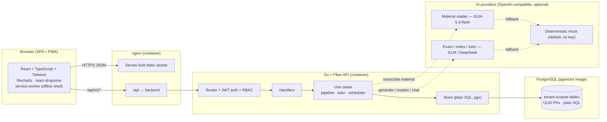
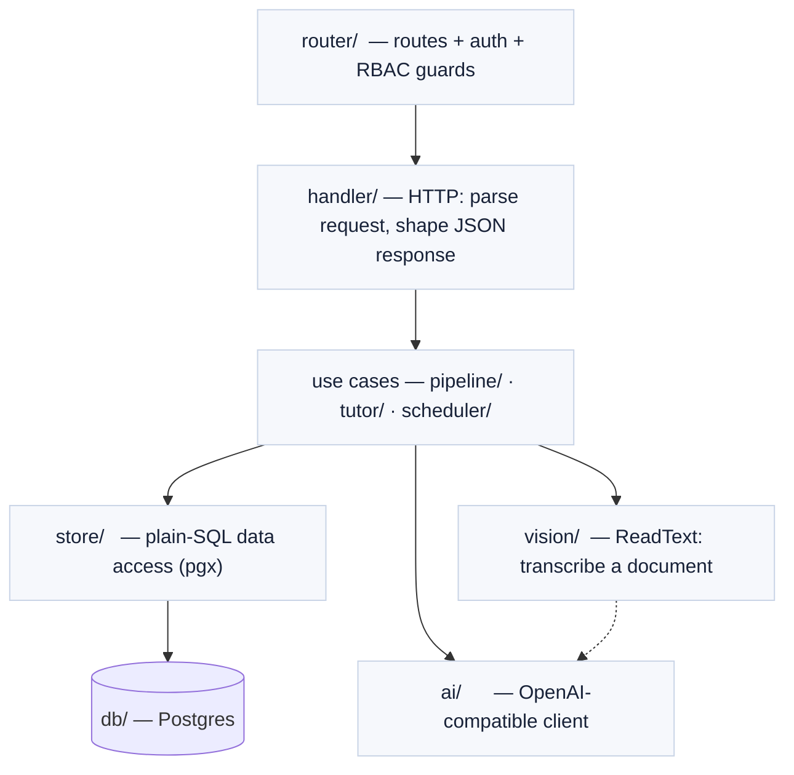
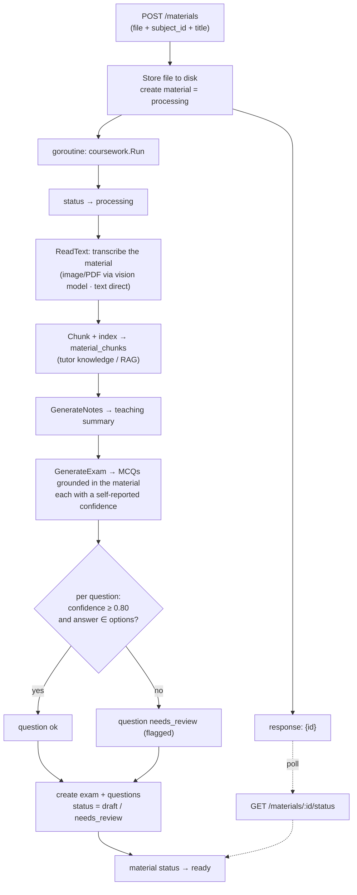
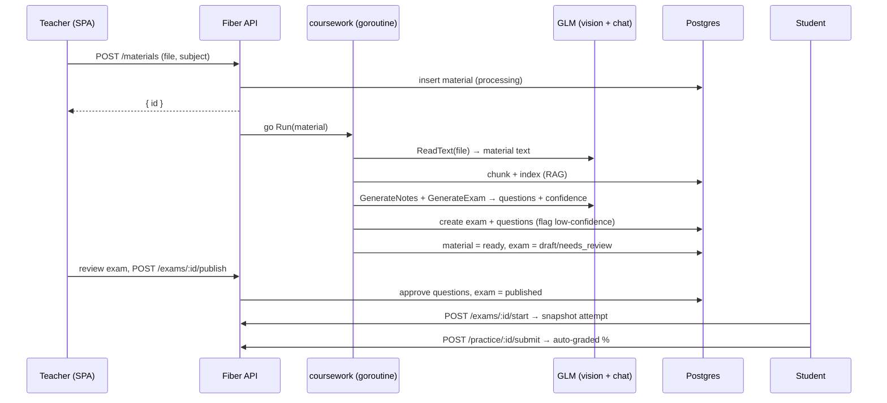
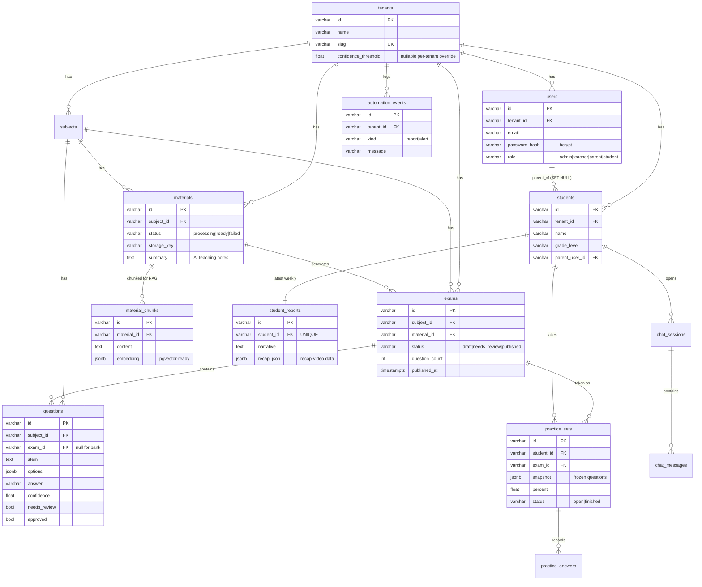
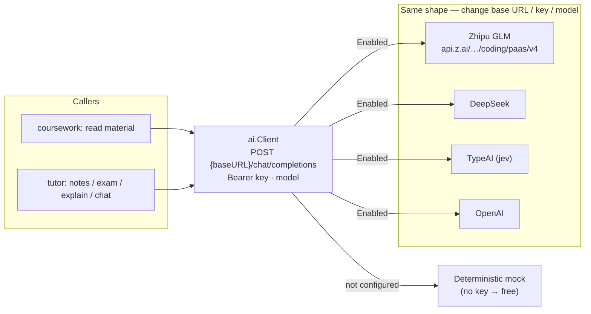
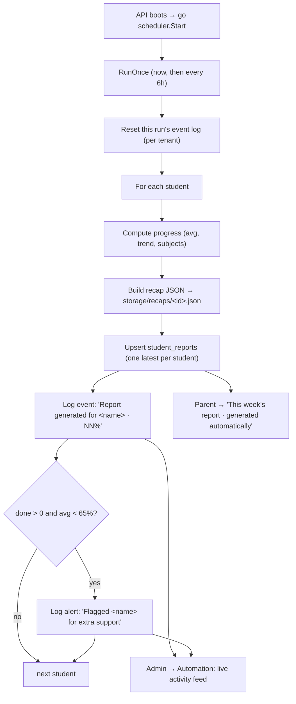
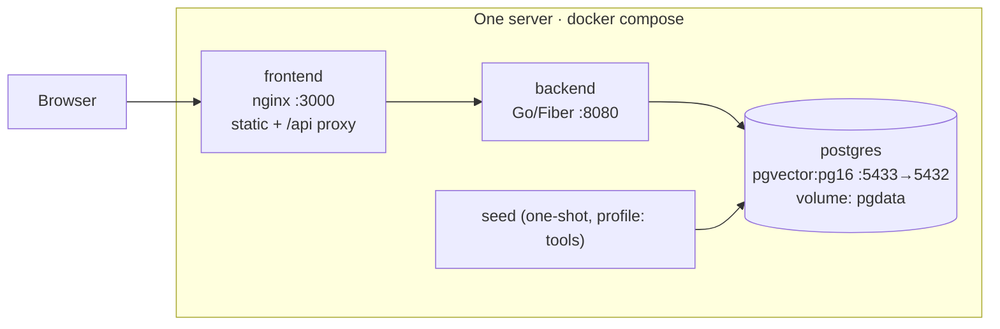

# Homework Studio — Technical Overview

**A self-hosted EdTech platform: teaching material in → AI-generated, teacher-approved exams out, plus auto-graded attempts, warm progress reports, and an AI tutor.**

> Independent portfolio demo. Not affiliated with any company. All data is synthetic.
> This document explains the architecture, the end-to-end data flow, the database
> design, and the engineering decisions behind each choice.

---

## 1. What it is

Homework Studio is the *platform layer* around a kids' learning product. It has four
roles and one pipeline:

| Role | What they do |
|---|---|
| 🧑‍🏫 **Teacher** | Upload **teaching material** (PDF/image/text). The AI reads it and generates a **custom exam**, **teaching notes**, and **tutor knowledge**. Low-confidence questions open a **review** step so the teacher approves them before publishing. |
| 🧒 **Student** | A gamified home (**XP, levels, streak, badges, leaderboard**), take a **published exam** (auto-graded), **practise** from the bank (earns XP, not graded), **review** past attempts, get **"Show me how"** explanations, and chat with an **AI tutor** grounded in the teacher's material. |
| 👪 **Parent** | A **family dashboard** — each child's grades *and* engagement (streak, level, badges), an AI **"how to help"** tip, **compare-to-class**, a **"what's new"** activity feed, and a **printable progress report**. |
| 🏫 **Admin** | A school **analytics dashboard** (mastery bands, at-risk early-warning, roster) and the **automation controls** (a live activity feed of what the background jobs did). |

The product's spine is a **document-ingestion → generation pipeline with a
human-in-the-loop confidence gate** — the teacher's material is read and turned into
an assessment, and the AI's least-confident questions wait for the teacher's approval
before students ever see them.

---

## 2. Architecture at a glance



**One request path, one data store, swappable AI.** The SPA talks only to the Go
JSON API. Every AI touchpoint has a deterministic **mock** fallback, so the whole
system runs with **no API key** and upgrades to real models with an env change.

---

## 3. Tech stack — and *why*

| Layer | Choice | Why this, not the obvious alternative |
|---|---|---|
| **Language** | **Go 1.26** | One static binary, fast cold start, trivial to self-host on a single server. Strong concurrency (the ingest pipeline runs in a goroutine) without extra infrastructure. |
| **HTTP** | **Fiber v2** (`v2.52`) | Minimal, express-style router on top of fasthttp. Middleware groups map cleanly onto role guards. Small surface, no framework lock-in. |
| **DB access** | **pgx v5** + **plain SQL** (no ORM) | The queries here are analytics-shaped (aggregations, distributions, joins). Hand-written SQL is faster to reason about and tune than an ORM's generated queries, and there is no hidden N+1. `pgxpool` gives connection pooling. |
| **Migrations** | Embedded `.sql`, applied at startup | No migration CLI to install; the binary owns its schema. `CREATE TABLE IF NOT EXISTS` keeps startup idempotent. |
| **IDs** | **ULID** (`oklog/ulid`), generated in Go | Sortable by creation time, URL-safe, no DB round-trip to mint an ID, no sequence contention. Stored as `VARCHAR(26)`. |
| **Auth** | **JWT** (`golang-jwt v5`) + **bcrypt** (`x/crypto`) | Stateless tokens (no server session store) fit a self-hosted single binary. bcrypt for password hashing. |
| **Database** | **PostgreSQL** (`pgvector/pgvector:pg16`) | Self-hosted, battle-tested. The image ships **pgvector**, so the RAG embeddings can move from JSONB to a real vector index without changing databases. **Supabase-compatible** — Supabase *is* managed Postgres. |
| **Frontend** | **Vite + React 18 + TypeScript + Tailwind** | Fast dev server + tiny production bundle. A plain SPA (no SSR) because this is an authenticated app, not a content site. **The same React/Tailwind components move to Next.js unchanged** if that stack is preferred. |
| **Charts / UX** | Recharts · react-dropzone · react-markdown + KaTeX | Recharts for the score distributions and trends; react-dropzone for the upload; react-markdown + KaTeX to render the tutor's LaTeX explanations. |
| **PWA** | **vite-plugin-pwa** (Workbox) | Installable app + offline app shell via an auto-updating service worker. |
| **AI client** | One **OpenAI-compatible** client | GLM, DeepSeek, TypeAI (jev), and OpenAI all speak the same `/chat/completions` shape — only base URL / key / model change. No per-vendor SDKs. |
| **Deploy** | **Docker Compose** | `postgres + backend + frontend` on one host behind nginx. One `docker compose up`. |

---

## 4. Clean architecture — how the code is layered

Business logic (grading, gating, explanations, practice generation) is isolated
from HTTP and SQL, so it is unit-testable and provider-agnostic.



```
backend/
├── cmd/
│   ├── api/        server entrypoint (wires config → store → coursework/tutor/scheduler → router)
│   └── seed/       one-shot demo seed (1 school, 4 logins, 2 subjects, bank, exams, attempts)
└── internal/
    ├── config/     env loading + provider switches
    ├── db/         connection pool + embedded migrations (applied at startup)
    ├── domain/     entities + enums (Material, Exam, Question, …) + ULID mint
    ├── auth/       JWT issue/verify, bcrypt
    ├── middleware/ RequireAuth, RequireRole
    ├── store/      plain-SQL access — one file per aggregate (material, exams, tutor, admin, …)
    ├── vision/     ReadText: transcribe a document (image/PDF via the vision model, text direct)
    ├── ai/         tiny OpenAI-compatible chat client (GLM/DeepSeek/TypeAI/OpenAI) + ChatVision
    ├── coursework/ read material → index (RAG) → teaching notes → generate exam → gate
    ├── tutor/      exam generator, teaching notes, explanations + grading, RAG chat
    ├── scheduler/  background job: weekly reports + recap data + auto-flagging
    ├── handler/    HTTP handlers
    └── router/     route table
```

**Dependency rule:** handlers depend on use cases; use cases depend on the store
and on the `ai.Client` *interface* — never on a concrete provider. Swapping GLM for
DeepSeek, or a real model for the mock, is a constructor argument (or an env flag),
not a code change.

---

## 5. The coursework pipeline — material → exam

The heart of the ingest → generation side. A teacher uploads teaching material; the
handler stores the file, creates a `processing` material, and kicks the pipeline off
**asynchronously** (in a goroutine) so the request returns immediately. The frontend
polls status.



**The confidence gate** — now on the *generated* questions:

```
generate questions (per-question confidence) → GATE → decide
                                                 │
        every question ≥ threshold ────────────►  draft (ready to publish)
        any question  < threshold ────────────►  needs_review → teacher approves
```

An exam is **published only after the teacher approves it**. Questions the model was
least sure about are **flagged**; the teacher reviews them (keep, or discard), then
publishes. This is human-in-the-loop by construction: the AI never puts a question in
front of students that the teacher hasn't signed off on.

### Sequence: upload → generate → review → publish → take



---

## 6. Database design (ERD)

Plain Postgres, **ULID string PKs generated in Go**, every business table scoped by
`tenant_id` for multi-school isolation. Schema is applied at startup from embedded
SQL (`0001_init.sql` … `0004_coursework.sql`).



**Notes on the design**

- **`questions.confidence` + `needs_review` + `approved`** are the gate: a generated
  question below the threshold (or whose answer isn't among its options) is flagged
  and un-approved until the teacher publishes. Bank questions keep the defaults
  (confidence 1, approved) and carry a null `exam_id`.
- **`exams`** groups generated questions; `status` walks `draft`/`needs_review` →
  `published`. A student attempt is a `practice_sets` row linked by `exam_id`.
- **`practice_sets.snapshot`** freezes the exact questions (JSONB) when the attempt
  starts, so it grades against what the student saw — a resumable, tamper-resistant
  attempt. Finished attempts (`status='finished'`, `percent`) are the single source
  for all progress/dashboard/admin analytics.
- Student **progress, class stats, and the admin roster all derive from finished
  `practice_sets`** — there is no separate results table. Grades count only exam
  attempts (`exam_id IS NOT NULL`); ungraded practice (`exam_id IS NULL`) still earns
  XP.
- **Gamification (XP / level / streak / badges) and the leaderboard are computed on
  the fly** from those attempts — no points ledger or badge tables. Per-question
  answers are saved to `practice_answers` so an attempt can be reviewed.
- **`material_chunks.embedding`** is JSONB today (cosine similarity in Go). The
  Postgres image already ships **pgvector**, so this becomes a real `vector` column
  + ANN index with no database migration.
- **`student_reports`** has a **UNIQUE** `student_id`: the scheduler *upserts* one
  latest report per student. `recap_json` carries the data a recap video renders from.
- **`ai_usage`** (not drawn) logs prompt/completion tokens per feature per tenant —
  the metering hook for a real deployment.

---

## 7. AI architecture — swappable, mock by default

Everything AI goes through one **OpenAI-compatible** client. `Enabled()` is true only
when both a key and base URL are set; otherwise callers fall back to a deterministic
mock, so the demo is free and reproducible.



| Touchpoint | Env | Real provider | Fallback |
|---|---|---|---|
| **Material reader (vision)** | `VISION_PROVIDER=glm`, `VISION_MODEL=glm-5.3-flash` | GLM transcribes the uploaded PDF/image to text (PDFs rasterized with poppler `pdftoppm` first). | Text files read directly; a labelled placeholder otherwise. |
| **Exam + notes + tutor** | `AI_PROVIDER=glm`, `AI_MODEL=glm-5.3`, `AI_BASE_URL=…/coding/paas/v4` | GLM authors exam questions (with confidence) grounded in the material, writes teaching notes + LaTeX explanations, and answers RAG chat. | Bank-sampled exam / excerpt notes / mock explanation / canned chat. |

The client is OpenAI-compatible, so **DeepSeek, TypeAI (`jev`), or OpenAI** drop in by
changing base URL + key + model. The **confidence threshold** for flagging a generated
question is `0.80` (a question is also flagged if its answer isn't among its options).

---

## 8. Automation — the hands-off layer

Two things run without anyone pressing a button:

1. **The coursework pipeline** (§5) — every material read, indexed, and turned into a
   gated exam on upload.
2. **A background scheduler** — runs once on startup and then every
   `SCHEDULER_INTERVAL` (default `6h`).



The `automation_events` log is what surfaces the automation in the UI: the **admin
Automation page** shows a live feed (reports written + students auto-flagged) with a
**Run now** trigger, and the **parent page** shows the auto-generated report card.
That is how a background job becomes something a user can *see*.

---

## 9. API surface

All under `/api/v1`. Auth is a Bearer JWT; roles are enforced by middleware.

| Method | Path | Role | Purpose |
|---|---|---|---|
| `POST` | `/auth/login` | public | Email + password → JWT |
| `GET` | `/auth/me` | any | Current user |
| `GET` | `/subjects` | any | Subjects for the tenant |
| `GET` | `/students` | any | Students (scoped) |
| `GET` | `/students/:id/progress` | any | Average, timeline, subject strengths |
| `GET` | `/reports/student/:id` | any | Latest auto-generated weekly report |
| `GET` | `/family` · `/family/activity` | parent | Children (grades + engagement) / "what's new" feed |
| `GET` | `/students/:id/vs-class` · `/students/:id/tip` | parent | Child vs class average / AI "how to help" tip |
| `POST` | `/materials` | teacher, admin | Upload material → kicks off the coursework pipeline |
| `GET` | `/materials` · `/materials/:id` · `/:id/status` | teacher, admin | List / notes / poll status |
| `GET` | `/exams` · `/exams/:id` | teacher, admin | List generated exams / one with its questions |
| `POST` | `/exams/:id/publish` | teacher, admin | Approve remaining questions → publish |
| `POST` | `/exams/:id/questions/:qid/discard` | teacher, admin | Drop a rejected question |
| `GET` | `/dashboard/class` | teacher, admin | Class stats + distribution |
| `GET` | `/admin/overview` · `/admin/automation` | admin | School analytics / scheduler feed |
| `POST` | `/admin/automation/run` | admin | Trigger the scheduler now |
| `GET` | `/exams/published` | any | Published exams a student can take |
| `POST` | `/exams/:id/start` | any | Snapshot a published exam into an attempt |
| `POST` | `/practice/generate` | any | Ungraded practice set from the bank (earns XP) |
| `POST` | `/practice/:id/submit` | any | Auto-grade an attempt (persists per-question answers) |
| `GET` | `/students/:id/gamification` | any | XP / level / streak / badges (derived) |
| `GET` | `/students/:id/attempts` · `/attempts/:id/review` | any | Results list / review one attempt |
| `GET` | `/leaderboard` | any | Class ranking by XP |
| `GET` | `/questions/:id/explain` | any | Step-by-step explanation |
| `POST` | `/tutor/chat` | any | RAG tutor chat |

**Auth & RBAC.** `RequireAuth` verifies the JWT and loads the user; `RequireRole`
guards teacher/admin and admin-only groups. Every query is scoped by `tenant_id`,
and ownership checks stop a parent from reading another child's data (returns 403).

---

## 10. Deployment



```bash
# 1. Start Postgres + backend + frontend
docker compose -f docker/docker-compose.yml --profile full up -d --build
# 2. Seed the demo dataset
docker compose -f docker/docker-compose.yml --profile tools run --rm seed
# 3. Open  → frontend http://localhost:3000 · API http://localhost:8080/health
```

**Config** is environment-first (`internal/config`). Real AI is opt-in: copy
`docker/.env.example` → `docker/.env` (gitignored) with a GLM key and
`docker compose up` runs on real models. Defaults keep the stack on the free mock.

| Variable | Default | Meaning |
|---|---|---|
| `DATABASE_URL` | local Postgres | pgx connection string |
| `AI_PROVIDER` / `AI_MODEL` / `AI_BASE_URL` / `AI_API_KEY` | `mock` | Exam + notes + tutor |
| `VISION_PROVIDER` / `VISION_MODEL` | `mock` / `glm-5.3-flash` | Material reader (transcription) |
| `SCHEDULER_ENABLED` / `SCHEDULER_INTERVAL` | `true` / `6h` | Background reports |
| `ACCESS_TOKEN_TTL_MINUTES` | `720` | JWT lifetime |

---

## 11. Design decisions & trade-offs

- **No ORM.** The read side is analytics (aggregations, distributions). Plain SQL is
  clearer and faster to tune here, and there is no hidden query behavior. The cost —
  writing SQL by hand — is small at this schema size.
- **Async pipeline, poll for status.** Upload returns immediately and the coursework
  pipeline runs in a goroutine; the SPA polls `/materials/:id/status`. Simple and
  dependency-free (no queue broker). For higher volume this is where a real
  worker/queue slots in — the pipeline is already a self-contained unit.
- **Mock-by-default AI.** The demo is free and reproducible; every AI path degrades
  gracefully to a deterministic result. Real models are one env flag away.
- **JSONB embeddings, pgvector image.** Keeps the demo dependency-light while leaving
  a zero-migration path to a real vector index.
- **Stateless JWT.** No session store to run; fits a single self-hosted binary.
- **SPA on a JSON API.** The frontend is decoupled; the identical React/Tailwind
  components port to Next.js unchanged if server rendering is later wanted.

---

## 12. Verify it works

```bash
cd backend && go build ./... && go vet ./...   # compiles clean
cd frontend && npm run build                   # tsc --noEmit + vite build
```

The end-to-end flow: teacher uploads material → the AI generates an exam and flags a
low-confidence question → teacher reviews and publishes → a student takes the exam,
is auto-graded, and gets an explanation → a parent sees the progress → the admin
watches the scheduler log reports and at-risk flags.

---

*See [`MANUAL.md`](MANUAL.md) for the per-role user guide, and
[`case-study.md`](case-study.md) for how each piece maps to a real product's needs.*
