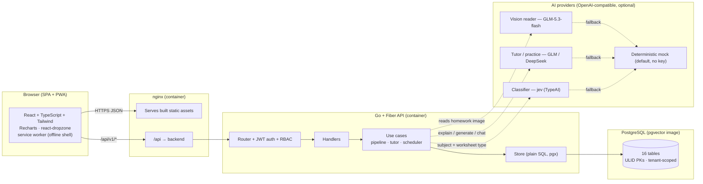
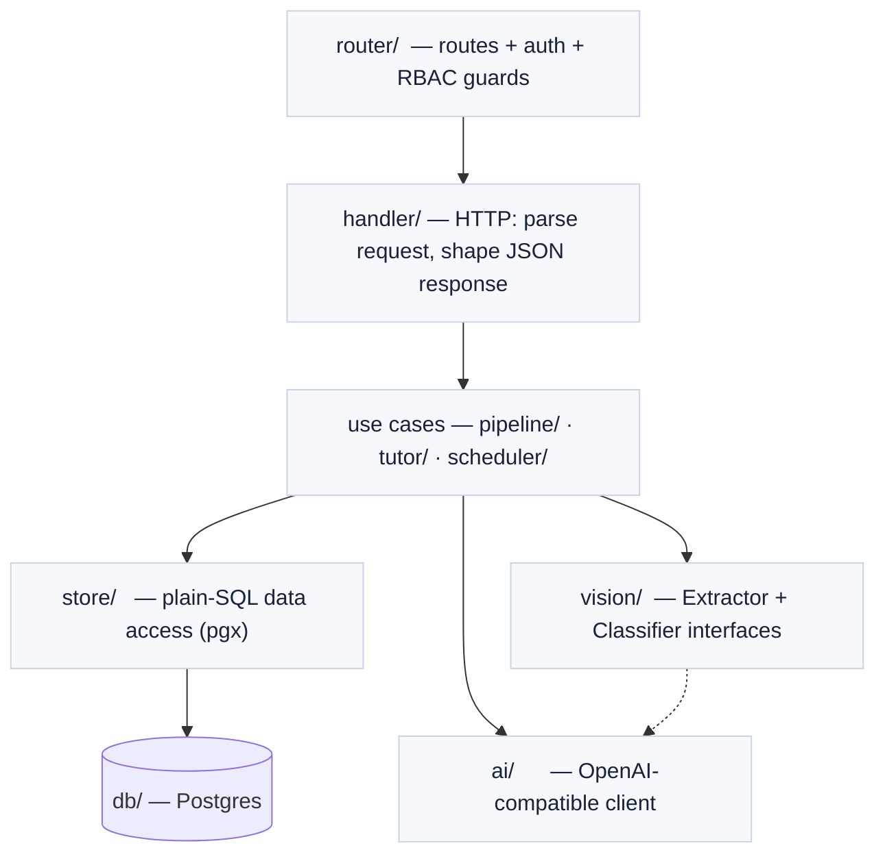
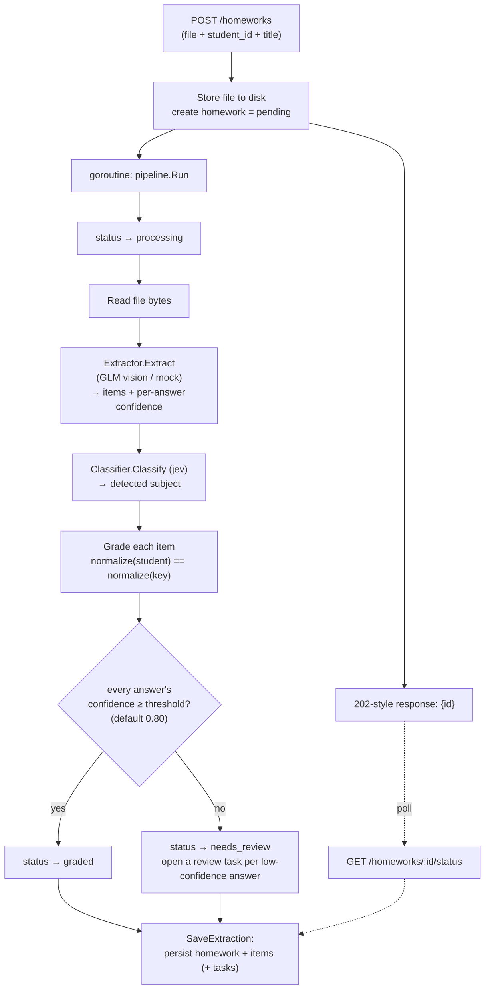
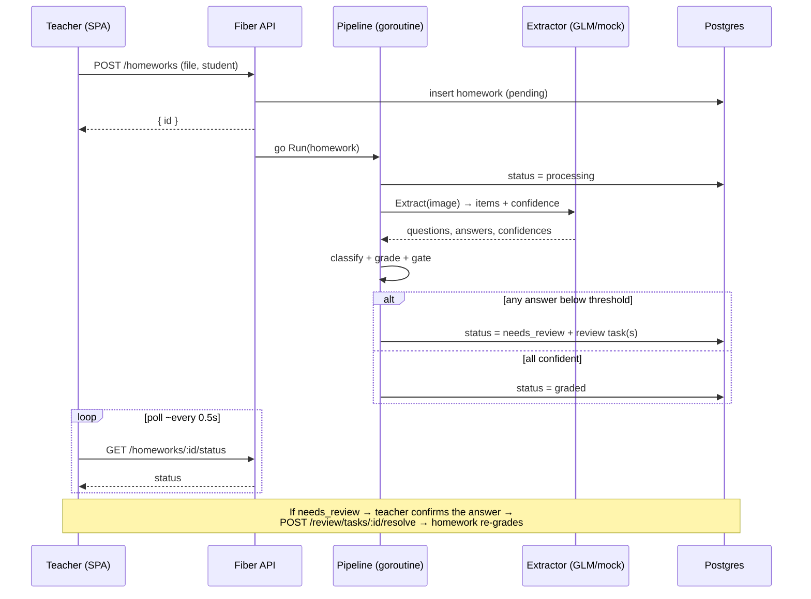
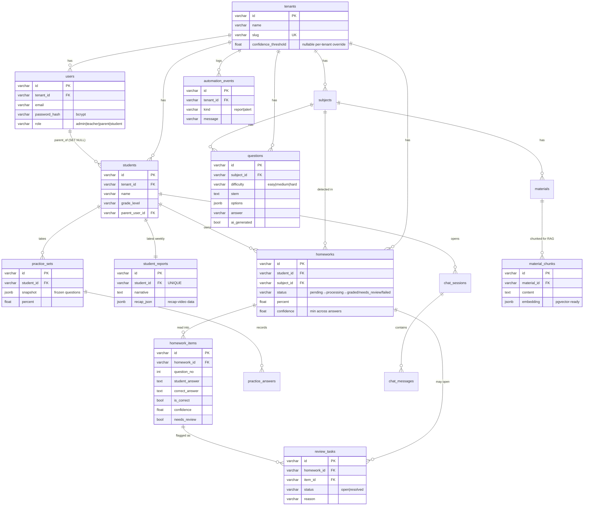
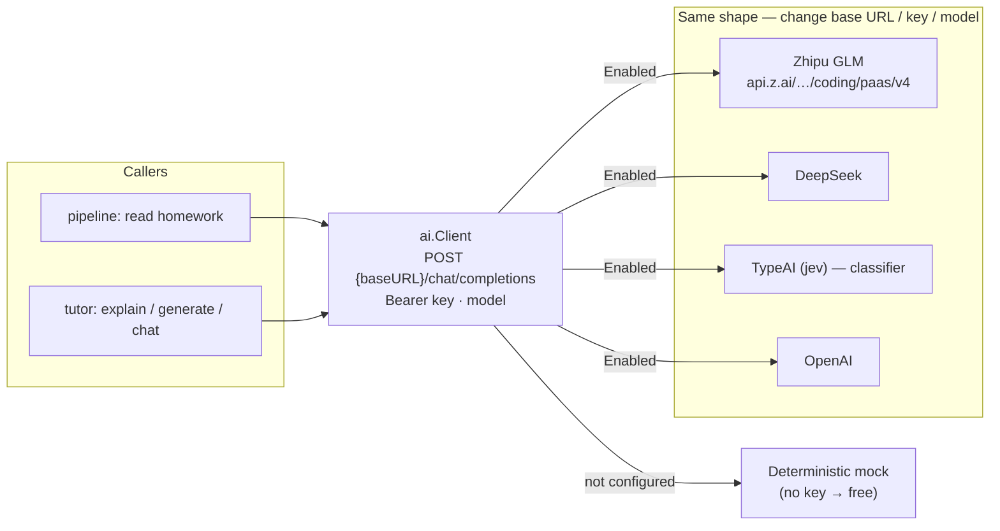
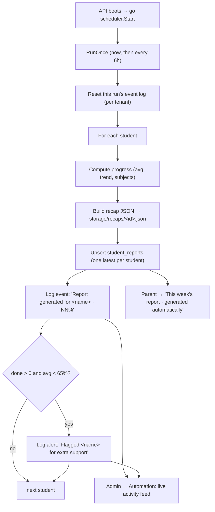
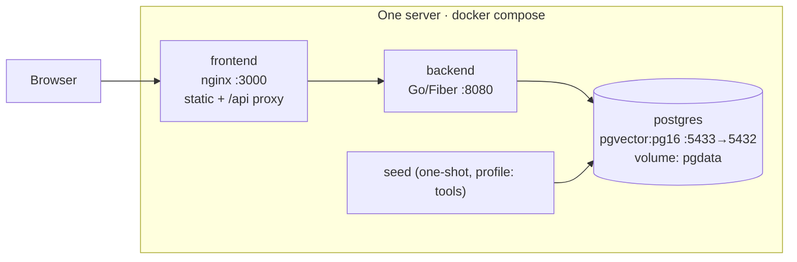

# Homework Studio — Technical Overview

**A self-hosted EdTech platform: homework in → read, graded, confidence-gated, and turned into a warm progress report, plus an AI tutor.**

> Independent portfolio demo. Not affiliated with any company. All data is synthetic.
> This document explains the architecture, the end-to-end data flow, the database
> design, and the engineering decisions behind each choice.

---

## 1. What it is

Homework Studio is the *platform layer* around a kids' learning product. It has four
roles and one pipeline:

| Role | What they do |
|---|---|
| 🧑‍🏫 **Teacher** | Upload a child's homework (PDF/photo). It is read question-by-question with a **confidence per answer**, auto-graded, and anything the reader wasn't sure about opens a **review task** instead of silently grading. |
| 👪 **Parent** | See the child's progress in plain language — average, trend, strength by subject — and open a **printable progress report**. |
| 🧒 **Student** | Generate a **practice set**, get instant scoring, tap **"Show me how"** for a step-by-step (LaTeX) explanation, and chat with an **AI tutor** grounded in the class material. |
| 🏫 **Admin** | A school **analytics dashboard** (mastery bands, at-risk early-warning, roster) and the **automation controls** (a live activity feed of what the background jobs did). |

The product's spine is a **document-ingestion pipeline with a human-in-the-loop
confidence gate** — the same pattern real document-processing systems use, applied
here to a child's homework so a teacher stays in control of the grade.

---

## 2. Architecture at a glance



**One request path, one data store, swappable AI.** The SPA talks only to the Go
JSON API. Every AI touchpoint has a deterministic **mock** fallback, so the whole
system runs with **no API key** and upgrades to real models with an env change.

---

## 3. Tech stack — and *why*

| Layer | Choice | Why this, not the obvious alternative |
|---|---|---|
| **Language** | **Go 1.26** | One static binary, fast cold start, trivial to self-host on a single server. Strong concurrency (the ingest pipeline runs in a goroutine) without extra infrastructure. |
| **HTTP** | **Fiber v2** (`v2.52`) | Minimal, express-style router on top of fasthttp. Middleware groups map cleanly onto role guards. Small surface, no framework lock-in. |
| **DB access** | **pgx v5** + **plain SQL** (no ORM) | The queries here are analytics-shaped (aggregations, distributions, joins). Hand-written SQL is faster to reason about and tune than an ORM's generated queries, and there is no hidden N+1. `pgxpool` gives connection pooling. |
| **Migrations** | Embedded `.sql`, applied at startup | No migration CLI to install; the binary owns its schema. `CREATE TABLE IF NOT EXISTS` keeps startup idempotent. |
| **IDs** | **ULID** (`oklog/ulid`), generated in Go | Sortable by creation time, URL-safe, no DB round-trip to mint an ID, no sequence contention. Stored as `VARCHAR(26)`. |
| **Auth** | **JWT** (`golang-jwt v5`) + **bcrypt** (`x/crypto`) | Stateless tokens (no server session store) fit a self-hosted single binary. bcrypt for password hashing. |
| **Database** | **PostgreSQL** (`pgvector/pgvector:pg16`) | Self-hosted, battle-tested. The image ships **pgvector**, so the RAG embeddings can move from JSONB to a real vector index without changing databases. **Supabase-compatible** — Supabase *is* managed Postgres. |
| **Frontend** | **Vite + React 18 + TypeScript + Tailwind** | Fast dev server + tiny production bundle. A plain SPA (no SSR) because this is an authenticated app, not a content site. **The same React/Tailwind components move to Next.js unchanged** if that stack is preferred. |
| **Charts / UX** | Recharts · react-dropzone · react-markdown + KaTeX | Recharts for the score distributions and trends; react-dropzone for the upload; react-markdown + KaTeX to render the tutor's LaTeX explanations. |
| **PWA** | **vite-plugin-pwa** (Workbox) | Installable app + offline app shell via an auto-updating service worker. |
| **AI client** | One **OpenAI-compatible** client | GLM, DeepSeek, TypeAI (jev), and OpenAI all speak the same `/chat/completions` shape — only base URL / key / model change. No per-vendor SDKs. |
| **Deploy** | **Docker Compose** | `postgres + backend + frontend` on one host behind nginx. One `docker compose up`. |

---

## 4. Clean architecture — how the code is layered

Business logic (grading, gating, explanations, practice generation) is isolated
from HTTP and SQL, so it is unit-testable and provider-agnostic.



```
backend/
├── cmd/
│   ├── api/        server entrypoint (wires config → store → pipeline/tutor/scheduler → router)
│   └── seed/       one-shot demo seed (1 school, 4 logins, 2 subjects, question bank)
└── internal/
    ├── config/     env loading + provider switches
    ├── db/         connection pool + embedded migrations (applied at startup)
    ├── domain/     entities + enums (Homework, ReviewTask, Question, …) + ULID mint
    ├── auth/       JWT issue/verify, bcrypt
    ├── middleware/ RequireAuth, RequireRole
    ├── store/      plain-SQL access — one file per aggregate (homework, tutor, admin, …)
    ├── vision/     Extractor (read the image) + Classifier (jev) interfaces + mock + LLM impls
    ├── ai/         tiny OpenAI-compatible chat client (GLM/DeepSeek/TypeAI/OpenAI)
    ├── pipeline/   read → classify → grade → gate → decide
    ├── tutor/      explanations, practice generator + grading, RAG chat
    ├── scheduler/  background job: weekly reports + recap data + auto-flagging
    ├── handler/    HTTP handlers
    └── router/     route table
```

**Dependency rule:** handlers depend on use cases; use cases depend on the store
and on the `vision.Extractor` / `ai.Client` *interfaces* — never on a concrete
provider. Swapping GLM for DeepSeek, or a real reader for the mock, is a
constructor argument, not a code change.

---

## 5. The ingest pipeline — end to end

The heart of the ingest side. A teacher uploads a file; the handler stores it,
creates a `pending` homework, and kicks the pipeline off **asynchronously** (in a
goroutine) so the HTTP request returns immediately. The frontend then polls status.



**The confidence gate** is the key idea:

```
read (per-answer confidence) → grade → GATE → decide
                                         │
        every answer ≥ threshold ───────►  graded
        any answer  < threshold ───────►  needs_review → teacher review task
```

A homework auto-grades **only when every answer cleared the threshold**. Otherwise
a review task names the exact question and reason (`"low read confidence (62%) —
please confirm"`). When the teacher resolves it, the homework **re-grades itself**.
This is human-in-the-loop by construction: the model never silently decides a
child's grade off a shaky read.

### Sequence: upload → gate → review → re-grade



---

## 6. Database design (ERD)

Plain Postgres, **ULID string PKs generated in Go**, every business table scoped by
`tenant_id` for multi-school isolation. Schema is applied at startup from embedded
SQL (`internal/db/migrations/0001_init.sql`, `0002_reports.sql`,
`0003_automation_events.sql`).



**Notes on the design**

- **`homeworks.confidence`** stores the *minimum* answer confidence — the number the
  gate decides on. **`homework_items.needs_review`** marks the specific answers that
  tripped it, and each opens a `review_tasks` row linked to its item.
- **`practice_sets.snapshot`** freezes the exact questions (JSONB) at generation
  time, so a set grades against what the student actually saw even if the bank
  changes — a resumable, tamper-resistant attempt (adapted from an exam engine).
- **`material_chunks.embedding`** is JSONB today (cosine similarity in Go). The
  Postgres image already ships **pgvector**, so this becomes a real `vector` column
  + ANN index with no database migration.
- **`student_reports`** has a **UNIQUE** `student_id`: the scheduler *upserts* one
  latest report per student. `recap_json` carries the data a recap video renders from.
- **`ai_usage`** (not drawn) logs prompt/completion tokens per feature per tenant —
  the metering hook for a real deployment.

---

## 7. AI architecture — swappable, mock by default

Everything AI goes through one **OpenAI-compatible** client. `Enabled()` is true only
when both a key and base URL are set; otherwise callers fall back to a deterministic
mock, so the demo is free and reproducible.



| Touchpoint | Env | Real provider | Fallback |
|---|---|---|---|
| **Homework reader (vision)** | `VISION_PROVIDER=glm`, `VISION_MODEL=glm-5.3-flash` | GLM reads the photo/PDF, extracts each question + handwritten answer with confidence. PDFs are rasterized with poppler `pdftoppm` first. | Mock reader (deterministic items). |
| **Tutor + explanations** | `AI_PROVIDER=glm`, `AI_MODEL=glm-5.3`, `AI_BASE_URL=…/coding/paas/v4` | GLM authors LaTeX step-by-steps, writes fresh practice questions, answers RAG chat. | Mock explanation / bank sampling / canned chat. |
| **Classifier** | `CLASSIFIER_PROVIDER=typeai`, `CLASSIFIER_MODEL=jev` | jev identifies subject / worksheet type. | Keyword match on filename + questions. |

The **confidence threshold** that drives the gate is `REVIEW_CONFIDENCE_THRESHOLD`
(default `0.80`), with an optional per-tenant override column.

---

## 8. Automation — the hands-off layer

Two things run without anyone pressing a button:

1. **The ingest pipeline** (§5) — every upload reads, grades, and gates itself.
2. **A background scheduler** — runs once on startup and then every
   `SCHEDULER_INTERVAL` (default `6h`).



The `automation_events` log is what surfaces the automation in the UI: the **admin
Automation page** shows a live feed (reports written + students auto-flagged) with a
**Run now** trigger, and the **parent page** shows the auto-generated report card.
That is how a background job becomes something a user can *see*.

---

## 9. API surface

All under `/api/v1`. Auth is a Bearer JWT; roles are enforced by middleware.

| Method | Path | Role | Purpose |
|---|---|---|---|
| `POST` | `/auth/login` | public | Email + password → JWT |
| `GET` | `/auth/me` | any | Current user |
| `GET` | `/subjects` | any | Subjects for the tenant |
| `GET` | `/students` | any | Students (scoped) |
| `GET` | `/students/:id/progress` | any | Average, timeline, subject strengths |
| `GET` | `/reports/student/:id` | any | Latest auto-generated weekly report |
| `POST` | `/homeworks` | teacher, admin | Upload → kicks off the pipeline |
| `GET` | `/homeworks` · `/homeworks/:id` · `/:id/status` | any | List / detail / poll status |
| `GET` | `/review/tasks` | teacher, admin | Open review queue |
| `POST` | `/review/tasks/:id/resolve` | teacher, admin | Confirm answer → re-grade |
| `GET` | `/dashboard/class` | teacher, admin | Class stats + distribution |
| `GET` | `/admin/overview` | admin | School analytics |
| `GET` | `/admin/automation` | admin | Scheduler status + event feed |
| `POST` | `/admin/automation/run` | admin | Trigger the scheduler now |
| `GET` | `/questions/:id/explain` | any | Step-by-step explanation |
| `POST` | `/practice/generate` | any | Make a practice set |
| `POST` | `/practice/:id/submit` | any | Grade a practice set |
| `POST` | `/tutor/chat` | any | RAG tutor chat |

**Auth & RBAC.** `RequireAuth` verifies the JWT and loads the user; `RequireRole`
guards teacher/admin and admin-only groups. Every query is scoped by `tenant_id`,
and ownership checks stop a parent from reading another child's data (returns 403).

---

## 10. Deployment



```bash
# 1. Start Postgres + backend + frontend
docker compose -f docker/docker-compose.yml --profile full up -d --build
# 2. Seed the demo dataset
docker compose -f docker/docker-compose.yml --profile tools run --rm seed
# 3. Open  → frontend http://localhost:3000 · API http://localhost:8080/health
```

**Config** is environment-first (`internal/config`). Real AI is opt-in: copy
`docker/.env.example` → `docker/.env` (gitignored) with a GLM key and
`docker compose up` runs on real models. Defaults keep the stack on the free mock.

| Variable | Default | Meaning |
|---|---|---|
| `DATABASE_URL` | local Postgres | pgx connection string |
| `REVIEW_CONFIDENCE_THRESHOLD` | `0.80` | The gate |
| `AI_PROVIDER` / `AI_MODEL` / `AI_BASE_URL` / `AI_API_KEY` | `mock` | Tutor + practice |
| `VISION_PROVIDER` / `VISION_MODEL` | `mock` / `glm-5.3-flash` | Homework reader |
| `CLASSIFIER_PROVIDER` / `CLASSIFIER_MODEL` | `mock` / `jev` | Subject classifier |
| `SCHEDULER_ENABLED` / `SCHEDULER_INTERVAL` | `true` / `6h` | Background reports |
| `ACCESS_TOKEN_TTL_MINUTES` | `720` | JWT lifetime |

---

## 11. Design decisions & trade-offs

- **No ORM.** The read side is analytics (aggregations, distributions). Plain SQL is
  clearer and faster to tune here, and there is no hidden query behavior. The cost —
  writing SQL by hand — is small at this schema size.
- **Async pipeline, poll for status.** Upload returns immediately and the pipeline
  runs in a goroutine; the SPA polls `/status`. Simple and dependency-free (no queue
  broker). For higher volume this is where a real worker/queue would slot in — the
  pipeline is already a self-contained unit.
- **Mock-by-default AI.** The demo is free and reproducible; every AI path degrades
  gracefully to a deterministic result. Real models are one env flag away.
- **JSONB embeddings, pgvector image.** Keeps the demo dependency-light while leaving
  a zero-migration path to a real vector index.
- **Stateless JWT.** No session store to run; fits a single self-hosted binary.
- **SPA on a JSON API.** The frontend is decoupled; the identical React/Tailwind
  components port to Next.js unchanged if server rendering is later wanted.

---

## 12. Verify it works

```bash
cd backend && go build ./... && go vet ./...   # compiles clean
cd frontend && npm run build                   # tsc --noEmit + vite build
```

The end-to-end flow: teacher uploads → the gate opens a review task for the
low-confidence answer → resolve → graded; a student generates and grades a practice
set and gets an explanation; a parent sees progress and is blocked (403) from another
child; the admin watches the scheduler log reports and at-risk flags.

---

*See [`MANUAL.md`](MANUAL.md) for the per-role user guide, and
[`case-study.md`](case-study.md) for how each piece maps to a real product's needs.*
